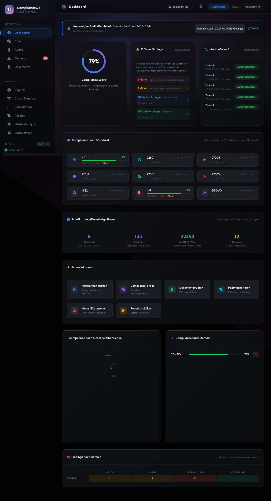
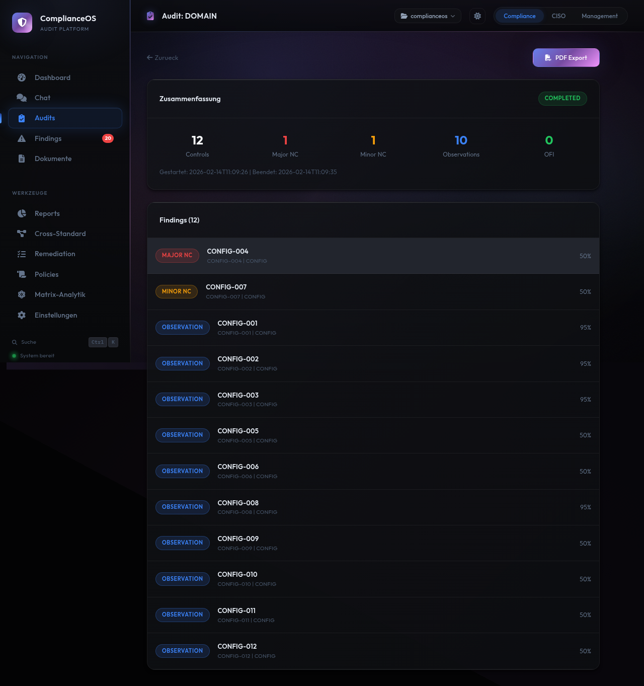

# ComplianceOS

**KI-gestuetzte On-Premise Compliance-Audit-Plattform**


---

> **Hinweis:** ComplianceOS ersetzt keine professionelle Rechts- oder Compliance-Beratung.
> Die Ergebnisse dienen als Entscheidungsgrundlage und muessen von qualifizierten
> Fachpersonen geprueft werden.

---

## Was ist ComplianceOS?

ComplianceOS ist eine On-Premise-Plattform fuer automatisierte Compliance-Audits gegen internationale Sicherheitsstandards. Die Anwendung laeuft vollstaendig auf Ihrer eigenen Infrastruktur — keine Daten verlassen Ihr Netzwerk. Eine optionale KI-Integration (Claude) unterstuetzt bei der Analyse und Beratung.

ComplianceOS richtet sich an IT-Sicherheitsbeauftragte, Compliance-Manager und CISOs, die ihre Audit-Prozesse strukturieren und automatisieren moechten.

## Features

### 9 Compliance-Standards

| Standard | Version | Controls |
|----------|---------|----------|
| ISO/IEC 27001 | 2022 | Annex A (93 Controls) |
| ISO 22301 | 2019 | Business Continuity |
| ISO/IEC 27005 | 2022 | Risikomanagement |
| ISO/IEC 27017 | 2015 | Cloud Security |
| ISO/IEC 27018 | 2019 | Cloud Privacy |
| ISO/IEC 27035 | 2023 | Incident Management |
| NIS2 | 2022/2555 | EU-Richtlinie |
| BSI IT-Grundschutz | 2023 | Kompendium |
| DSGVO | 2016/679 | Datenschutz |

### Kernfunktionen

- **Audit-Engine** — 135 Controls in 12 Domains mit 2.246 semantischen Pruefpunkten, automatische und manuelle Checks
- **KI-Chat** — Compliance-Fragen stellen, Findings analysieren, Empfehlungen erhalten (Claude AI, optional)
- **Findings-Management** — Severity-Klassifikation, Status-Workflow, Zuweisung, Deadlines
- **Remediation-Tracking** — Massnahmen verfolgen, Verantwortliche zuweisen, Fortschritt messen
- **Policy-Generator** — 6 Vorlagen (Passwort, Backup, Incident, Zugriff, ISMS, Datenschutz)
- **Drift-Detection** — Regressionen zwischen Audit-Laeufen automatisch erkennen
- **Cross-Standard-Mapping** — Controls standarduebergreifend zuordnen und Synergien nutzen
- **Executive Dashboard** — Risiko-Matrix, Business Impact, Compliance-Trends
- **Dokument-Pipeline** — PDF, DOCX, XLSX, Markdown hochladen und analysieren
- **Multi-Projekt** — Mehrere Organisationen/Projekte parallel verwalten

### Design

ComplianceOS nutzt das **Obsidian Prism** Design System — ein professionelles Dark-Theme mit Edelstein-Farbpalette (Sapphire, Amethyst, Ruby, Emerald). Schriften: Outfit (UI) + IBM Plex Mono (Code).






## Installation

### Voraussetzungen

- Docker und Docker Compose
- Mindestens 512 MB RAM, 1 GB Festplatte
- Optional: [Claude Code](https://claude.ai/claude-code) Subscription fuer KI-Features

### Quick Start

```bash
# 1. Repository klonen
git clone https://github.com/silentspike/complianceos.git
cd complianceos

# 2. Starten
docker compose up -d

# 3. Browser oeffnen
open http://localhost:8001
```

Das war's. ComplianceOS laeuft.

### Aktualisieren

```bash
docker compose pull
docker compose up -d
```

### Stoppen

```bash
docker compose down
```

Daten bleiben im Docker Volume `complianceos-data` erhalten.

## Konfiguration

Alle Einstellungen ueber Umgebungsvariablen in `docker-compose.yml`:

| Variable | Standard | Beschreibung |
|----------|----------|-------------|
| `COMPLIANCEOS_PORT` | `8001` | Server-Port |
| `COMPLIANCEOS_LOG_LEVEL` | `INFO` | Log-Level (DEBUG, INFO, WARNING, ERROR) |
| `COMPLIANCEOS_LANG` | `de` | Sprache (de, en) |
| `ENABLE_TEAMMATES` | `false` | KI-Agent-Orchestrierung |
| `ENABLE_PDF_UPLOAD` | `true` | PDF-Upload aktivieren |
| `ENABLE_POLICY_GEN` | `true` | Policy-Generierung aktivieren |
| `ENABLE_DSGVO` | `true` | DSGVO-Standard aktivieren |

## Datenschutz

ComplianceOS ist eine **On-Premise-Anwendung**:

- Alle Daten werden lokal in SQLite gespeichert
- Keine Telemetrie, kein Tracking, keine externe Datenuebertragung
- **Ohne KI-Integration:** Kein Netzwerkverkehr nach aussen
- **Mit KI-Integration (optional):** Audit-Pruefpunkte und Findings-Analysen werden an die Claude API gesendet. Dokumente, Reports und die Datenbank verlassen Ihr System nicht.

Die KI-Integration ist vollstaendig optional und kann durch Weglassen der Umgebungsvariable `ENABLE_TEAMMATES=false` deaktiviert werden.

## Dokumentation

Die vollstaendige Bedienungsanleitung finden Sie unter:

**[Dokumentation](https://silentspike.github.io/complianceos/)**

Inhalt:
- Schnellstart-Anleitung
- Bedienung aller Module (Dashboard, Audits, Findings, Chat, Policies, Reports, ...)
- Referenz (Standards, Glossar, FAQ, Tastaturkuerzel)

## Support

- **Bugs und Feature-Requests:** [GitHub Issues](https://github.com/silentspike/complianceos/issues)
- **Sicherheitsprobleme:** Siehe [SECURITY.md](SECURITY.md)

## Lizenz

ComplianceOS ist proprietaere Software. Siehe [LICENSE](LICENSE) fuer Details.

Copyright (c) 2026 ComplianceOS / silentspike. Alle Rechte vorbehalten.
