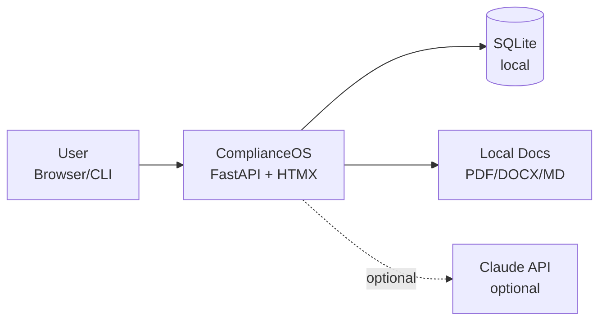

# ComplianceOS

**KI-gestützte On-Premise Compliance-Audit-Plattform**  
**AI-assisted on-premise compliance audit platform**

---

> **Hinweis:** ComplianceOS ersetzt keine professionelle Rechts- oder Compliance-Beratung.
> Die Ergebnisse dienen als Entscheidungsgrundlage und müssen von qualifizierten
> Fachpersonen geprüft werden.

---

> **For international reviewers:** ComplianceOS is an on-premise
> compliance audit platform for regulated organizations and the public
> sector. It runs entirely on customer infrastructure, with optional
> Claude AI integration that can be disabled. No telemetry, SQLite
> storage, EULA-based proprietary license, 90-day evaluation pilots.
> [Full English Summary →](#english-summary) · [Request evaluation →](#evaluation-anfordern)

---

## Why this matters for AI deployment

Running AI in regulated environments is first an architecture
question, not a model question. ComplianceOS demonstrates the boundary
pattern: **on-prem core**, **optional AI integration** (`ENABLE_TEAMMATES=false`
disables it entirely), **no telemetry**, **local SQLite + document
storage**, **EULA-based evaluation flow**.

→ Full discussion: [`docs/business/ai-deployment-relevance.md`](docs/business/ai-deployment-relevance.md)

## Was ist ComplianceOS?

ComplianceOS ist eine On-Premise-Plattform für automatisierte Compliance-Audits gegen internationale Sicherheitsstandards. Die Anwendung läuft vollständig auf Ihrer eigenen Infrastruktur — keine Daten verlassen Ihr Netzwerk. Eine optionale KI-Integration (Claude) unterstützt bei der Analyse und Beratung.

ComplianceOS richtet sich an IT-Sicherheitsbeauftragte, Compliance-Manager und CISOs, die ihre Audit-Prozesse strukturieren und automatisieren möchten.

> 📋 **Evaluation anfordern / Request evaluation:** [Issue-Template öffnen](https://github.com/silentspike/complianceos/issues/new?template=evaluation_request.yml)
> — 90-Tage-Pilot mit vollem Funktionsumfang auf Ihrer Infrastruktur.

> ⚠ **Hinweis zum Repository:** Dieses öffentliche Repository enthält die
> Dokumentation und Evaluation-Surface. Anwendungs-Source und ausführbare
> Binaries werden privat unter EULA bereitgestellt. Siehe
> [Evaluation anfordern](#evaluation-anfordern).

## Datenfluss

```mermaid
flowchart LR
    User[User<br/>Browser/CLI]
    App[ComplianceOS<br/>FastAPI + HTMX]
    DB[(SQLite<br/>local)]
    Docs[Local Docs<br/>PDF/DOCX/MD]
    Claude[Claude API<br/>optional]

    User --> App
    App --> DB
    App --> Docs
    App -.optional.-> Claude
```

Macht den No-Telemetry / On-Prem / Optional-AI-Charakter sofort sichtbar:
nur ein einziger optionaler Out-Pfad (gestrichelt) verlaesst die Kunden-
Infrastruktur, alles andere bleibt lokal.

## ROI-Beispiele / ROI scenarios

Walkthrough-style cost-benefit calculations for three regulated-sector
audit cycles:

- [`examples/roi-iso27001-mid-enterprise.md`](examples/roi-iso27001-mid-enterprise.md) — Mid-Enterprise (200-5000 employees, ISO 27001 first audit)
- [`examples/roi-nis2-kritis.md`](examples/roi-nis2-kritis.md) — KRITIS-Betreiber unter NIS2 Art. 21
- [`examples/roi-b3s-hospital.md`](examples/roi-b3s-hospital.md) — Krankenhaus B3S (DSGVO + B3S-Krankenhaus)

Werte sind illustrativ, nicht Vertragsgrundlage / values are illustrative, not contractual.

## Features

### 9 Compliance-Standards

| Standard | Version | Controls |
|----------|---------|----------|
| ISO/IEC 27001 | 2022 | Annex A (93 Controls) |
| ISO 22301 | 2019 | Business Continuity |
| ISO/IEC 27005 | 2022 | Risikomanagement |
| ISO/IEC 27017 | 2015 | Cloud Security |
| ISO/IEC 27018 | 2019 | Cloud Privacy |
| ISO/IEC 27035 | 2023 | Incident Management |
| NIS2 | 2022/2555 | EU-Richtlinie |
| BSI IT-Grundschutz | 2023 | Kompendium |
| DSGVO | 2016/679 | Datenschutz |

### Kernfunktionen

- **Audit-Engine** — 135 Controls in 12 Domains mit 2.285 semantischen Prüfpunkten, automatische und manuelle Checks
- **KI-Chat** — Compliance-Fragen stellen, Findings analysieren, Empfehlungen erhalten (Claude AI, optional)
- **Findings-Management** — Severity-Klassifikation, Status-Workflow, Zuweisung, Deadlines
- **Remediation-Tracking** — Massnahmen verfolgen, Verantwortliche zuweisen, Fortschritt messen
- **Policy-Generator** — 6 Vorlagen (Passwort, Backup, Incident, Zugriff, ISMS, Datenschutz)
- **Drift-Detection** — Regressionen zwischen Audit-Läufen automatisch erkennen
- **Cross-Standard-Mapping** — Controls standardübergreifend zuordnen und Synergien nutzen
- **Executive Dashboard** — Risiko-Matrix, Business Impact, Compliance-Trends
- **Dokument-Pipeline** — PDF, DOCX, XLSX, Markdown hochladen und analysieren
- **Multi-Projekt** — Mehrere Organisationen/Projekte parallel verwalten

### Design

ComplianceOS nutzt das **Obsidian Prism** Design System — ein professionelles Dark-Theme mit Edelstein-Farbpalette (Sapphire, Amethyst, Ruby, Emerald). Schriften: Outfit (UI) + IBM Plex Mono (Code).

## Für wen ist ComplianceOS?

ComplianceOS richtet sich an regulierte Organisationen und den öffentlichen
Sektor, bei denen Compliance nicht verhandelbar ist und Daten nicht in eine
fremde Cloud dürfen:

- **KRITIS-Betreiber** (Energie, Wasser, Telekommunikation) unter NIS2 / KritisV
- **Krankenhäuser und Gesundheitsdienstleister** (B3S-Krankenhaus, DSGVO)
- **Finanzdienstleister** unter BAIT / VAIT / ZAIT und DORA
- **Ministerien und öffentliche Verwaltung** (BSI IT-Grundschutz)
- **Regulierter Mittelstand** (200 - 5000 Mitarbeiter) mit ISO 27001 / TISAX-Pflicht

## Evaluation anfordern

ComplianceOS ist proprietäre Software und wird nicht als öffentlicher
Binary-Download bereitgestellt. Für Evaluationen und kommerzielle Lizenzen:

- **Evaluation Request:** [Issue-Template oeffnen](https://github.com/silentspike/complianceos/issues/new?template=evaluation_request.yml)
- **Dokumentation:** [silentspike.github.io/complianceos](https://silentspike.github.io/complianceos/)

Die Evaluation umfasst ein 90-Tage-Pilot-Zeitfenster mit vollem Funktionsumfang
auf Ihrer Infrastruktur, fachliche Begleitung durch silentspike und dokumentierte
Compliance-Artefakte für das erste Audit-Zyklus.

## Datenschutz

ComplianceOS ist eine **On-Premise-Anwendung**:

- Alle Daten werden lokal in SQLite gespeichert
- Keine Telemetrie, kein Tracking, keine externe Datenübertragung
- **Ohne KI-Integration:** Kein Netzwerkverkehr nach außen
- **Mit KI-Integration (optional):** Audit-Prüfpunkte und Findings-Analysen werden an die Claude API gesendet. Dokumente, Reports und die Datenbank verlassen Ihr System nicht.

Die KI-Integration ist vollständig optional und kann durch Weglassen der Umgebungsvariable `ENABLE_TEAMMATES=false` deaktiviert werden.

Hintergrund zum Deployment-Modell und der On-Prem-AI-Boundary: siehe
[AI Deployment in regulierten Umgebungen](docs/business/ai-deployment-relevance.md).

## Dokumentation

Die vollständige Bedienungsanleitung finden Sie unter:

**[Dokumentation](https://silentspike.github.io/complianceos/)**

Inhalt:
- Schnellstart-Anleitung
- Bedienung aller Module (Dashboard, Audits, Findings, Chat, Policies, Reports, ...)
- Referenz (Standards, Glossar, FAQ, Tastaturkürzel)

### Tiefer einsteigen

Wenn Sie evaluieren oder eine Beschaffungs-Entscheidung vorbereiten,
sind diese Seiten der schnellste Einstieg:

| Wofür | Link |
|---|---|
| Wie ist ComplianceOS aufgebaut? | [Architektur-Überblick](docs/architecture.md) und [Control-Matrix Workflow](docs/architecture/control-matrix-workflow.md) |
| Wie sieht ein Report aus? | [Synthetisches Beispiel-Report](docs/samples/sample-audit-report.html) |
| Passt das zu unserer Organisation? | [Zielgruppen](docs/business/for-who.md) |
| Was ist die Wirtschaftlichkeit? | [ROI-Szenarien (6 illustrative)](docs/business/roi.md) |
| Wie sieht eine Audit-Aufwand-Rechnung im Detail aus? | [`examples/`](examples/) — ISO 27001 Mid-Enterprise, NIS2 KRITIS, B3S Krankenhaus |
| Welche Regulierungen werden adressiert? | [Regulierungs-Detailseiten](docs/business/regulations/) — NIS2, B3S Krankenhaus, BAIT/VAIT/ZAIT, DORA, BSI IT-Grundschutz, TISAX |

## Kontakt

- **Evaluation / Kommerzielle Lizenz:** [Evaluation Request Template](https://github.com/silentspike/complianceos/issues/new?template=evaluation_request.yml)
- **Bugs und Feature-Requests:** [GitHub Issues](https://github.com/silentspike/complianceos/issues)
- **Sicherheitsprobleme:** Siehe [SECURITY.md](SECURITY.md)

## Lizenz

ComplianceOS ist proprietäre Software. Siehe [LICENSE](LICENSE) für Details.

Copyright (c) 2026 ComplianceOS / silentspike. Alle Rechte vorbehalten.

## English Summary

### Hero

ComplianceOS is an on-premise compliance audit platform for regulated organizations and the public sector. It runs entirely on customer infrastructure with optional Claude AI support, no telemetry, and SQLite/local document storage.

### What it is

Automates audits against international security standards: ISO/IEC 27001:2022, ISO 22301, ISO/IEC 27005, ISO/IEC 27017/27018, ISO/IEC 27035, NIS2, BSI IT-Grundschutz, GDPR. Coverage: 9 standards, 135 controls in 12 domains, 2,285 semantic checkpoints.

### Audience

Built for KRITIS operators (energy, water, telecom under NIS2/KritisV), hospitals (B3S-Krankenhaus, GDPR), financial services (BAIT/VAIT/ZAIT, DORA), public administration (BSI IT-Grundschutz), and regulated mid-sized enterprises (200-5000 employees) with ISO 27001 / TISAX requirements.

### Architecture

See the [Mermaid data flow diagram](#datenfluss) above and the [Architecture Overview](docs/architecture.md). Stack: Python (FastAPI + HTMX + SQLite), with optional Claude API integration that can be disabled via environment variable (`ENABLE_TEAMMATES=false`).

### Evaluation flow

Private delivery under EULA. 90-day pilot on customer infrastructure. Compliance artifacts documented for the first audit cycle. Request via the [evaluation_request.yml](https://github.com/silentspike/complianceos/issues/new?template=evaluation_request.yml) issue template.

### Public/Private disclosure

This public repository contains documentation and evaluation surface. Application source and executable binaries are delivered privately under EULA. The product is proprietary software. See [docs/business/ai-deployment-relevance.md](docs/business/ai-deployment-relevance.md) for AI deployment in regulated environments.

### Resources

- Documentation: https://silentspike.github.io/complianceos/
- Evaluation request: https://github.com/silentspike/complianceos/issues/new?template=evaluation_request.yml
