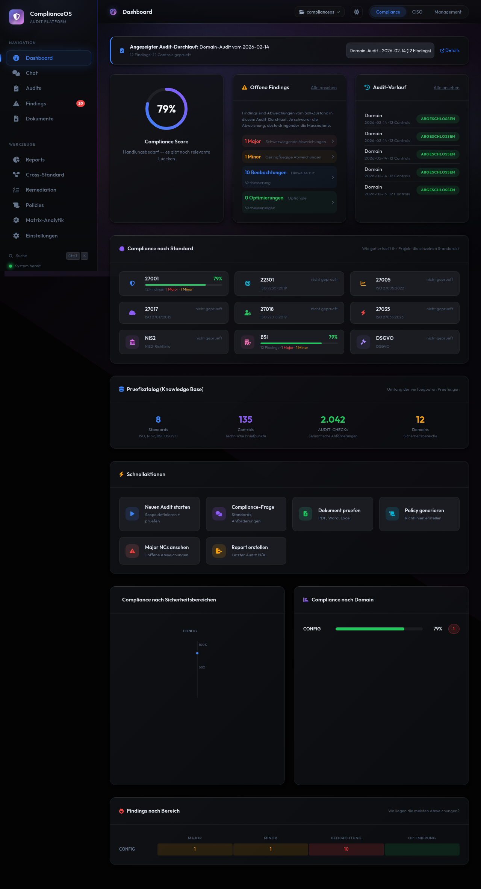
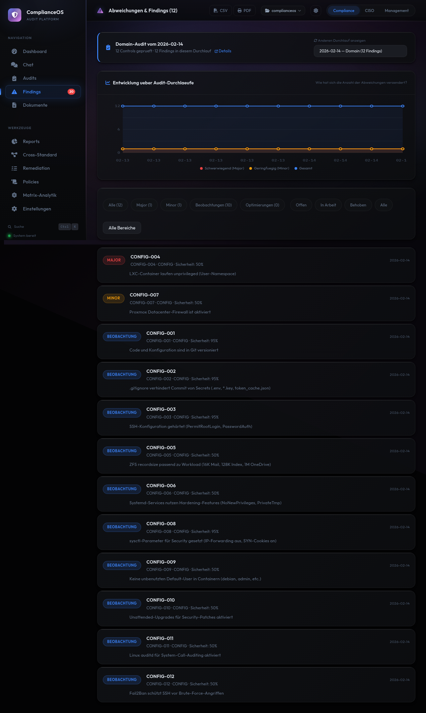
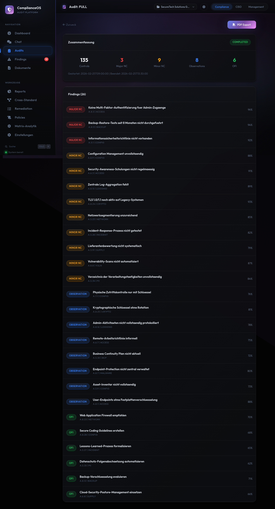

# ComplianceOS

**KI-gestuetzte On-Premise Compliance-Audit-Plattform**

---

> **Hinweis:** ComplianceOS ersetzt keine professionelle Rechts- oder Compliance-Beratung.
> Die Ergebnisse dienen als Entscheidungsgrundlage und muessen von qualifizierten
> Fachpersonen geprueft werden.

---

## Was ist ComplianceOS?

ComplianceOS ist eine On-Premise-Plattform fuer automatisierte Compliance-Audits gegen internationale Sicherheitsstandards. Die Anwendung laeuft vollstaendig auf Ihrer eigenen Infrastruktur — keine Daten verlassen Ihr Netzwerk. Eine optionale KI-Integration (Claude) unterstuetzt bei der Analyse und Beratung.

ComplianceOS richtet sich an IT-Sicherheitsbeauftragte, Compliance-Manager und CISOs, die ihre Audit-Prozesse strukturieren und automatisieren moechten.

## Features

### 9 Compliance-Standards

| Standard | Version | Controls |
|----------|---------|----------|
| ISO/IEC 27001 | 2022 | Annex A (93 Controls) |
| ISO 22301 | 2019 | Business Continuity |
| ISO/IEC 27005 | 2022 | Risikomanagement |
| ISO/IEC 27017 | 2015 | Cloud Security |
| ISO/IEC 27018 | 2019 | Cloud Privacy |
| ISO/IEC 27035 | 2023 | Incident Management |
| NIS2 | 2022/2555 | EU-Richtlinie |
| BSI IT-Grundschutz | 2023 | Kompendium |
| DSGVO | 2016/679 | Datenschutz |

### Kernfunktionen

- **Audit-Engine** — 135 Controls in 12 Domains mit 2.285 semantischen Pruefpunkten, automatische und manuelle Checks
- **KI-Chat** — Compliance-Fragen stellen, Findings analysieren, Empfehlungen erhalten (Claude AI, optional)
- **Findings-Management** — Severity-Klassifikation, Status-Workflow, Zuweisung, Deadlines
- **Remediation-Tracking** — Massnahmen verfolgen, Verantwortliche zuweisen, Fortschritt messen
- **Policy-Generator** — 6 Vorlagen (Passwort, Backup, Incident, Zugriff, ISMS, Datenschutz)
- **Drift-Detection** — Regressionen zwischen Audit-Laeufen automatisch erkennen
- **Cross-Standard-Mapping** — Controls standarduebergreifend zuordnen und Synergien nutzen
- **Executive Dashboard** — Risiko-Matrix, Business Impact, Compliance-Trends
- **Dokument-Pipeline** — PDF, DOCX, XLSX, Markdown hochladen und analysieren
- **Multi-Projekt** — Mehrere Organisationen/Projekte parallel verwalten

### Design

ComplianceOS nutzt das **Obsidian Prism** Design System — ein professionelles Dark-Theme mit Edelstein-Farbpalette (Sapphire, Amethyst, Ruby, Emerald). Schriften: Outfit (UI) + IBM Plex Mono (Code).

## Fuer wen ist ComplianceOS?

ComplianceOS richtet sich an regulierte Organisationen und den oeffentlichen
Sektor, bei denen Compliance nicht verhandelbar ist und Daten nicht in eine
fremde Cloud duerfen:

- **KRITIS-Betreiber** (Energie, Wasser, Telekommunikation) unter NIS2 / KritisV
- **Krankenhaeuser und Gesundheitsdienstleister** (B3S-Krankenhaus, DSGVO)
- **Finanzdienstleister** unter BAIT / VAIT / ZAIT und DORA
- **Ministerien und oeffentliche Verwaltung** (BSI IT-Grundschutz)
- **Regulierter Mittelstand** (200 - 5000 Mitarbeiter) mit ISO 27001 / TISAX-Pflicht

## Evaluation anfordern

ComplianceOS ist proprietaere Software und wird nicht als oeffentlicher
Binary-Download bereitgestellt. Fuer Evaluationen und kommerzielle Lizenzen:

- **Evaluation Request:** [Issue-Template oeffnen](https://github.com/silentspike/complianceos/issues/new?template=evaluation_request.yml)
- **Dokumentation:** [silentspike.github.io/complianceos](https://silentspike.github.io/complianceos/)

Die Evaluation umfasst ein 90-Tage-Pilot-Zeitfenster mit vollem Funktionsumfang
auf Ihrer Infrastruktur, fachliche Begleitung durch silentspike und dokumentierte
Compliance-Artefakte fuer das erste Audit-Zyklus.

## Datenschutz

ComplianceOS ist eine **On-Premise-Anwendung**:

- Alle Daten werden lokal in SQLite gespeichert
- Keine Telemetrie, kein Tracking, keine externe Datenuebertragung
- **Ohne KI-Integration:** Kein Netzwerkverkehr nach aussen
- **Mit KI-Integration (optional):** Audit-Pruefpunkte und Findings-Analysen werden an die Claude API gesendet. Dokumente, Reports und die Datenbank verlassen Ihr System nicht.

Die KI-Integration ist vollstaendig optional und kann durch Weglassen der Umgebungsvariable `ENABLE_TEAMMATES=false` deaktiviert werden.

## Dokumentation

Die vollstaendige Bedienungsanleitung finden Sie unter:

**[Dokumentation](https://silentspike.github.io/complianceos/)**

Inhalt:
- Schnellstart-Anleitung
- Bedienung aller Module (Dashboard, Audits, Findings, Chat, Policies, Reports, ...)
- Referenz (Standards, Glossar, FAQ, Tastaturkuerzel)

### Tiefer einsteigen

Wenn Sie evaluieren oder eine Beschaffungs-Entscheidung vorbereiten,
sind diese Seiten der schnellste Einstieg:

| Wofuer | Link |
|---|---|
| Wie ist ComplianceOS aufgebaut? | [Architektur-Ueberblick](docs/architecture.md) und [Control-Matrix Workflow](docs/architecture/control-matrix-workflow.md) |
| Wie sieht ein Report aus? | [Synthetisches Beispiel-Report](docs/samples/sample-audit-report.html) |
| Passt das zu unserer Organisation? | [Zielgruppen](docs/business/for-who.md) |
| Was ist die Wirtschaftlichkeit? | [ROI-Szenarien (6 illustrative)](docs/business/roi.md) |
| Welche Regulierungen werden adressiert? | [Regulierungs-Detailseiten](docs/business/regulations/) — NIS2, B3S Krankenhaus, BAIT/VAIT/ZAIT, DORA, BSI IT-Grundschutz, TISAX |

## Kontakt

- **Evaluation / Kommerzielle Lizenz:** [Evaluation Request Template](https://github.com/silentspike/complianceos/issues/new?template=evaluation_request.yml)
- **Bugs und Feature-Requests:** [GitHub Issues](https://github.com/silentspike/complianceos/issues)
- **Sicherheitsprobleme:** Siehe [SECURITY.md](SECURITY.md)

## Lizenz

ComplianceOS ist proprietaere Software. Siehe [LICENSE](LICENSE) fuer Details.

Copyright (c) 2026 ComplianceOS / silentspike. Alle Rechte vorbehalten.
