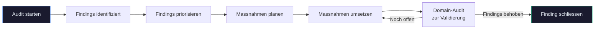

# Audits

Audits sind der Kern von ComplianceOS. Sie pruefen Ihre Infrastruktur systematisch gegen Compliance-Controls und identifizieren Abweichungen (Findings) nach Schweregrad.

<figure class="screenshot" markdown>

<figcaption>Audit-Seite: Startformular oben, Audit-Verlauf unten mit allen bisherigen Durchlaeufen</figcaption>
</figure>

---

## Audit-Modi

ComplianceOS bietet zwei Audit-Modi fuer unterschiedliche Anforderungen:

| Modus | Umfang | Dauer | Einsatzzweck |
|-------|--------|-------|-------------|
| **Vollaudit** | Alle 135 Controls in 12 Domains | 1-5 Minuten | Erstpruefung, regelmaessiger Compliance-Check |
| **Domain-Audit** | Controls einer einzelnen Domain | 10-60 Sekunden | Gezielter Nachtest nach Massnahmen |

### Vollaudit

Der Vollaudit prueft alle 135 technischen Controls ueber alle 12 Sicherheitsbereiche. Jeder Control wird anhand der zugehoerigen AUDIT-CHECKs bewertet. Am Ende erhalten Sie ein vollstaendiges Bild Ihres Compliance-Zustands.

**Empfohlen fuer:**

- Erstmalige Compliance-Bewertung
- Monatliche oder quartalsweise Regelaudits
- Vorbereitung auf externe Audits

### Domain-Audit

Der Domain-Audit prueft nur die Controls eines einzelnen Sicherheitsbereichs. Waehlen Sie die Domain im Dropdown aus:

| Domain | Controls | Pruefbereich |
|--------|----------|-------------|
| ACCESS | 15 | Zugriffskontrolle, Authentifizierung, Autorisierung |
| BACKUP | 10 | Datensicherung, Recovery-Tests, Aufbewahrung |
| BCP | 8 | Business Continuity Planning, Notfallplaene |
| CONFIG | 12 | Konfigurationsmanagement, Hardening |
| CRYPTO | 14 | Verschluesselung, Schluesselmanagement, Zertifikate |
| INCIDENT | 11 | Incident Management, Reaktionsplaene |
| LOGGING | 12 | Protokollierung, Monitoring, Alerting |
| MALWARE | 8 | Malware-Schutz, Endpoint Detection |
| NETWORK | 13 | Netzwerksicherheit, Segmentierung, Firewall |
| PII | 10 | Personenbezogene Daten, Datenschutz |
| SUPPLY | 8 | Lieferanten-Management, Third-Party-Risk |
| VULN | 14 | Schwachstellenmanagement, Patch-Management |

**Empfohlen fuer:**

- Nachpruefung nach Behebung von Findings in einer Domain
- Schneller Check eines einzelnen Bereichs
- Validierung nach Konfigurationsaenderungen

---

## Audit starten

1. Navigieren Sie zu **Audits** in der Seitenleiste
2. Der **Projekt-Pfad** ist bereits aus den Projekteinstellungen vorausgefuellt
3. Waehlen Sie den **Modus**:
      - **Vollstaendig**: Prueft alle 135 Controls
      - **Domain**: Waehlen Sie eine der 12 Domains im Dropdown
4. Klicken Sie auf **Audit starten**

!!! info "Audit-Dauer"
    - **Vollaudit:** 1-5 Minuten (abhaengig von Systemleistung und KI-Verfuegbarkeit)
    - **Domain-Audit:** 10-60 Sekunden
    - Der Fortschritt wird live auf der Seite angezeigt

!!! tip "KI-Bewertung"
    Wenn Claude AI verbunden ist, werden Controls zusaetzlich durch KI bewertet. Ohne KI-Anbindung laufen nur die regelbasierten (deterministischen) Checks. Die KI-Bewertung erhoet die Genauigkeit der Findings erheblich.

---

## Live-Fortschritt

Waehrend der Audit laeuft, zeigt ComplianceOS den Fortschritt in Echtzeit an (via Server-Sent Events):

- **Fortschrittsbalken** mit aktuellem Prozentsatz
- **Aktuelle Domain** die gerade geprueft wird
- **Control-Zaehler**: x von y Controls abgeschlossen
- **Findings in Echtzeit**: Neue Findings erscheinen sofort in der Liste

Der Fortschritt wird ueber SSE (Server-Sent Events) gestreamt — die Seite aktualisiert sich automatisch ohne Neuladen.

!!! warning "Browser-Tab offen lassen"
    Schliessen Sie den Browser-Tab nicht waehrend des Audits. Der Fortschritt wird nur im aktiven Tab angezeigt. Der Audit selbst laeuft im Hintergrund weiter — die Ergebnisse finden Sie anschliessend im Audit-Verlauf.

---

## Audit-Verlauf

Unterhalb des Startformulars listet der **Audit-Verlauf** alle bisherigen Durchlaeufe:

| Spalte | Beschreibung |
|--------|-------------|
| **Modus** | Vollstaendig oder Domain (mit Domain-Name) |
| **Datum** | Startzeitpunkt des Audits |
| **Controls** | Anzahl gepruefter Controls |
| **Status** | Badge "Abgeschlossen" oder "Laufend" |

Klicken Sie auf einen Eintrag um zur Detail-Ansicht zu gelangen.

---

## Audit-Detail

Die Detail-Ansicht zeigt die vollstaendigen Ergebnisse eines Audit-Durchlaufs:

<figure class="screenshot" markdown>

<figcaption>Audit-Detail: Zusammenfassung mit 135 Controls, Findings nach Severity, Domain-Aufschluesselung</figcaption>
</figure>

### Zusammenfassung

Der obere Bereich zeigt auf einen Blick:

- **Gesamtzahl Controls**: Wie viele Controls geprueft wurden
- **Findings nach Severity**:
    - Major NC (rot) — Schwerwiegende Nichtkonformitaeten
    - Minor NC (orange) — Geringfuegige Nichtkonformitaeten
    - Observations (blau) — Beobachtungen
    - OFI (lila) — Opportunities for Improvement
- **Compliant Controls**: Anzahl der Controls ohne Findings

### Domain-Aufschluesselung

Fuer jede der 12 Domains wird angezeigt:

- Anzahl gepruefter Controls in der Domain
- Anzahl und Severity der Findings
- Compliance-Grad der Domain (Prozent)

### Findings-Liste

Alle identifizierten Findings werden aufgelistet mit:

- **Control-ID** (z.B. CRYPTO-001)
- **Beschreibung** der Abweichung
- **Severity-Badge** (farbcodiert)
- **Domain** des Controls

Klicken Sie auf ein Finding um zur Finding-Detail-Ansicht zu gelangen (siehe [Findings](findings.md)).

### Metadaten

Am unteren Rand finden Sie:

- **Run-ID**: Eindeutige Kennung (z.B. `run-st-2026-02`)
- **Startzeitpunkt** und **Endzeitpunkt**
- **Dauer** des Audits
- **Modus** und ggf. ausgewaehlte Domain
- **Projekt**: Name des geprueften Projekts

---

## Audit-Vergleich

ComplianceOS ermoeglicht den direkten Vergleich zweier Audit-Durchlaeufe um Veraenderungen im Compliance-Zustand zu erkennen:

<figure class="screenshot" markdown>

<figcaption>Audit-Vergleich: Zwei Runs auswaehlen und Unterschiede analysieren</figcaption>
</figure>

### Vergleich starten

1. Oeffnen Sie einen Audit-Durchlauf in der Detail-Ansicht
2. Klicken Sie auf **Vergleichen**
3. Waehlen Sie im Dropdown den frueheren Audit-Lauf als Vergleichsbasis

### Vergleichsergebnis

Die Vergleichsansicht kategorisiert alle Findings in drei Gruppen:

| Kategorie | Bedeutung | Farbe |
|-----------|-----------|-------|
| **Neue Findings** | Im aktuellen Audit gefunden, im frueheren nicht | Rot |
| **Behobene Findings** | Im frueheren Audit vorhanden, im aktuellen nicht mehr | Gruen |
| **Unveraenderte Findings** | In beiden Audits vorhanden | Grau |

So erkennen Sie sofort:

- Welche Massnahmen erfolgreich waren (behobene Findings)
- Wo neue Probleme aufgetreten sind (neue Findings)
- Welche Findings noch offen sind (unveraendert)

!!! tip "Drift-Detection"
    Fuer eine ausfuehrlichere Analyse von Veraenderungen zwischen Audit-Laeufen nutzen Sie die [Drift-Detection](reports.md) unter **Reports**. Diese bietet zusaetzlich Score-Vergleiche, Domain-Trends und automatische Regression-Erkennung.

---

## Standards und Controls

### 9 unterstuetzte Standards

ComplianceOS prueft gegen folgende Standards:

| Standard | Beschreibung | Controls |
|----------|-------------|----------|
| **ISO 27001** | Informationssicherheits-Managementsystem | 36 |
| **ISO 22301** | Business Continuity Management | 12 |
| **ISO 27005** | Risikomanagement | 10 |
| **ISO 27017** | Cloud-Sicherheit | 14 |
| **ISO 27018** | Cloud-Datenschutz | 8 |
| **ISO 27035** | Incident Management | 11 |
| **NIS2** | EU-Cybersicherheitsrichtlinie | 18 |
| **BSI IT-Grundschutz** | BSI-Bausteine | 16 |
| **DSGVO** | Datenschutz-Grundverordnung | 10 |

### 135 Controls, 12 Domains

Jeder Control gehoert zu genau einer Domain und wird durch mehrere AUDIT-CHECKs geprueft. Insgesamt gibt es 2.042 AUDIT-CHECKs — die atomaren Pruefpunkte die bei jedem Audit durchlaufen werden.

### Verifikationsmethoden

Controls werden mit verschiedenen Methoden geprueft:

| Methode | Anzahl | Beschreibung |
|---------|--------|-------------|
| **Automated** | 71 | Automatische Pruefung per Datei-Analyse, Konfigurationscheck |
| **Hybrid** | 11 | Automatische Pruefung plus Interview-Fragen |
| **Manual** | 53 | Dokumenten-Review und organisatorische Bewertung |

---

## Geplante Audits

Unter **Einstellungen > Zeitplaene** koennen Sie automatische Audits einrichten:

| Intervall | Beschreibung | Empfehlung |
|-----------|-------------|------------|
| **Taeglich** | Jeden Tag zu einer bestimmten Uhrzeit | Fuer kritische Umgebungen |
| **Woechentlich** | Einmal pro Woche an einem bestimmten Tag | Fuer Standardumgebungen |
| **Monatlich** | Einmal pro Monat an einem bestimmten Tag | Minimum-Empfehlung |

Die Ergebnisse geplanter Audits erscheinen automatisch im Audit-Verlauf und im Dashboard. Optional koennen Sie sich per [ntfy-Benachrichtigung](einstellungen.md) ueber abgeschlossene Audits informieren lassen.

!!! warning "Voraussetzung"
    Geplante Audits funktionieren nur, solange der ComplianceOS-Container laeuft. Stellen Sie sicher dass der Container mit `restart: unless-stopped` konfiguriert ist.

---

## Tipps fuer effektive Audits

!!! tip "Erstaudit"
    Beim ersten Audit empfiehlt sich ein **Vollaudit** um den Ist-Zustand vollstaendig zu erfassen. Die Ergebnisse dienen als Baseline fuer kuenftige Vergleiche und Drift-Detection.

!!! tip "Nach Massnahmen"
    Wenn Sie Findings behoben haben, fuehren Sie einen **Domain-Audit** fuer die betroffene Domain durch. So validieren Sie gezielt ob die Massnahme erfolgreich war.

!!! tip "Vor externem Audit"
    Fuehren Sie vor einem externen Audit einen Vollaudit durch und generieren Sie einen [Report](reports.md). Der Report dient als Vorbereitung und zeigt den aktuellen Stand.

---

## Workflow: Vom Audit zur Massnahme

1. **Audit starten**: Vollaudit oder Domain-Audit durchfuehren
2. **Findings identifiziert**: ComplianceOS listet alle Abweichungen auf
3. **Findings priorisieren**: Major NCs zuerst, dann Minor NCs (siehe [Findings](findings.md))
4. **Massnahmen planen**: Remediation-Plan erstellen (siehe [Remediation](remediation.md))
5. **Massnahmen umsetzen**: Technische oder organisatorische Aenderungen durchfuehren
6. **Domain-Audit zur Validierung**: Gezielter Nachtest der betroffenen Domain
7. **Finding schliessen**: Bei erfolgreicher Behebung Status auf "Behoben" setzen

---

## Video: Audit-Workflow

<video controls width="100%">
  <source src="../videos/audit-workflow.mp4" type="video/mp4">
  Ihr Browser unterstuetzt kein Video. <a href="../videos/audit-workflow.mp4">Video herunterladen</a>.
</video>

Das Video zeigt den kompletten Audit-Workflow: Vom Dashboard ueber das Starten eines Audits bis zur Findings-Analyse.
