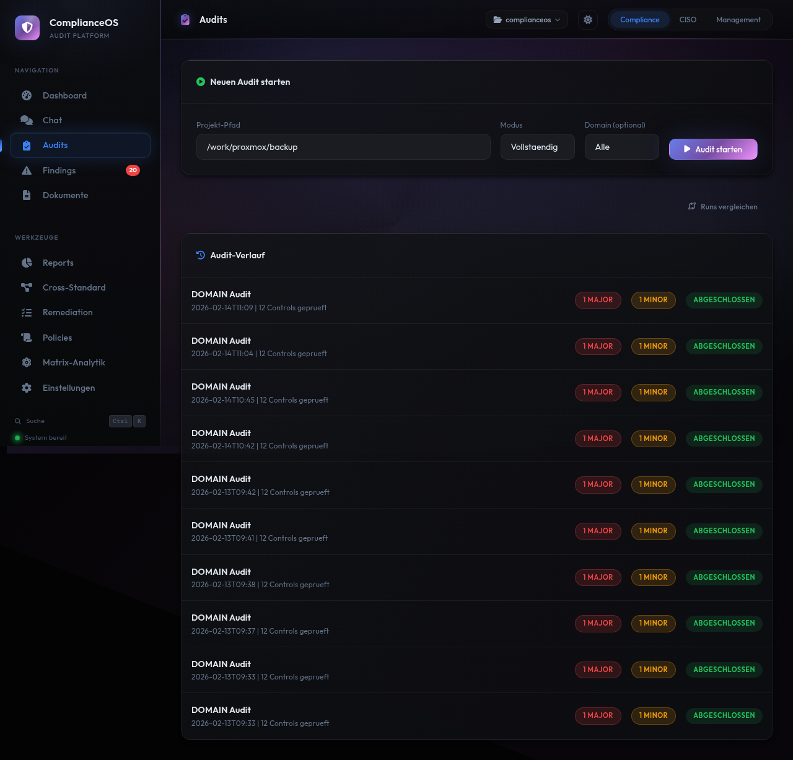
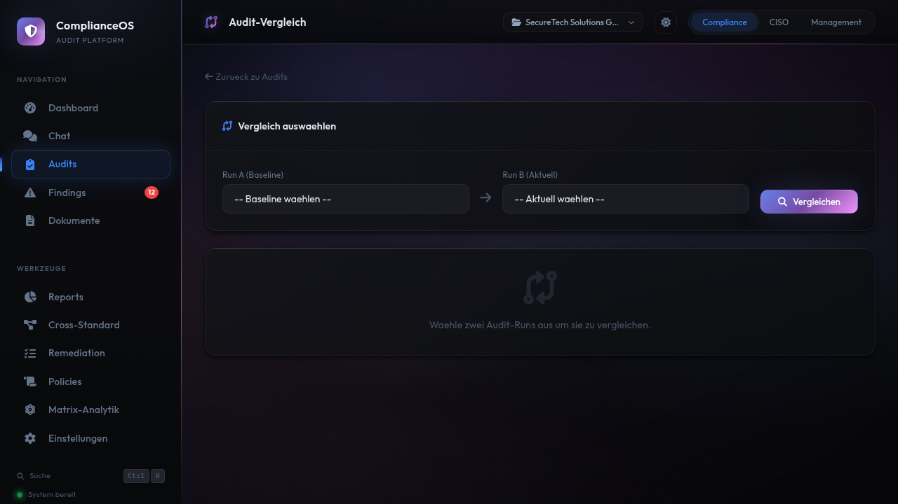
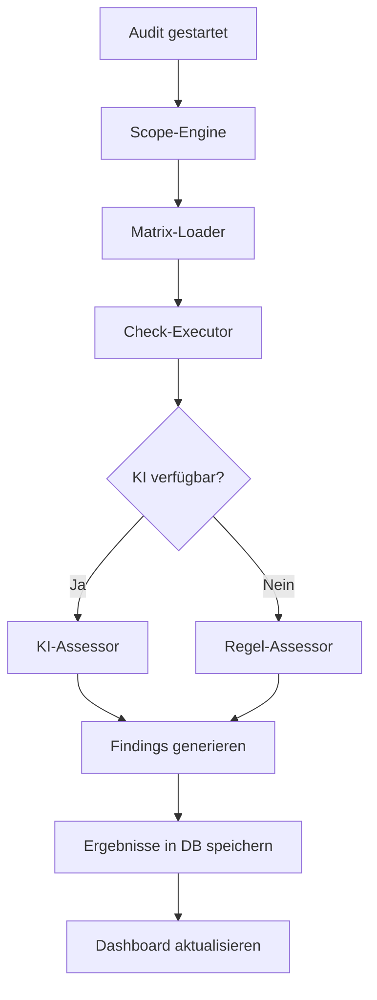
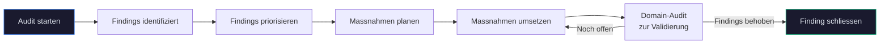

# Audits

Audits sind der Kern von ComplianceOS. Sie prüfen Ihre Infrastruktur systematisch gegen Compliance-Controls und identifizieren Abweichungen (Findings) nach Schweregrad.

<figure class="screenshot" markdown>

<figcaption>Audit-Seite: Startformular oben, Audit-Verlauf unten mit allen bisherigen Durchläufen</figcaption>
</figure>

---

## Audit-Modi

ComplianceOS bietet zwei Audit-Modi für unterschiedliche Anforderungen:

| Modus | Umfang | Dauer | Einsatzzweck |
|-------|--------|-------|-------------|
| **Vollaudit** | Alle 135 Controls in 12 Domains | 1-5 Minuten | Erstprüfung, regelmässiger Compliance-Check |
| **Domain-Audit** | Controls einer einzelnen Domain | 10-60 Sekunden | Gezielter Nachtest nach Massnahmen |

### Vollaudit

Der Vollaudit prüft alle 135 technischen Controls über alle 12 Sicherheitsbereiche. Jeder Control wird anhand der zugehörigen AUDIT-CHECKs bewertet. Am Ende erhalten Sie ein vollständiges Bild Ihres Compliance-Zustands.

**Empfohlen für:**

- Erstmalige Compliance-Bewertung
- Monatliche oder quartalsweise Regelaudits
- Vorbereitung auf externe Audits

### Domain-Audit

Der Domain-Audit prüft nur die Controls eines einzelnen Sicherheitsbereichs. Wählen Sie die Domain im Dropdown aus:

| Domain | Controls | Prüfbereich |
|--------|----------|-------------|
| ACCESS | 15 | Zugriffskontrolle, Authentifizierung, Autorisierung |
| BACKUP | 10 | Datensicherung, Recovery-Tests, Aufbewahrung |
| BCP | 8 | Business Continuity Planning, Notfallpläne |
| CONFIG | 12 | Konfigurationsmanagement, Hardening |
| CRYPTO | 14 | Verschlüsselung, Schlüsselmanagement, Zertifikate |
| INCIDENT | 11 | Incident Management, Reaktionspläne |
| LOGGING | 12 | Protokollierung, Monitoring, Alerting |
| MALWARE | 8 | Malware-Schutz, Endpoint Detection |
| NETWORK | 13 | Netzwerksicherheit, Segmentierung, Firewall |
| PII | 10 | Personenbezogene Daten, Datenschutz |
| SUPPLY | 8 | Lieferanten-Management, Third-Party-Risk |
| VULN | 14 | Schwachstellenmanagement, Patch-Management |

**Empfohlen für:**

- Nachprüfung nach Behebung von Findings in einer Domain
- Schneller Check eines einzelnen Bereichs
- Validierung nach Konfigurationsänderungen

---

## Was wird geprüft? — Quellen und Evidenz

ComplianceOS sammelt Evidenz aus mehreren Quellen. Je mehr Quellen verfügbar sind, desto höher die Aussagekraft des Audits.

### Quelle 1: Projekt-Verzeichnis (Hauptquelle)

Das **Projekt-Verzeichnis** ist der primäre Prüfgegenstand. Es ist das Verzeichnis auf dem Server, das Ihren Code, Konfigurationen und Infrastruktur-Dateien enthält.

Die Audit-Engine durchsucht dieses Verzeichnis automatisch nach Evidenz:

| Check-Typ | Was wird geprüft | Beispiele |
|-----------|-----------------|----------|
| **Grep** (Pattern-Suche) | Inhalte von Dateien nach Sicherheitsmustern durchsuchen | TLS-Konfiguration in `*.conf`, Passwort-Regeln in `*.py`, Verschlüsselungs-Algorithmen |
| **File** (Datei-Existenz) | Ob bestimmte Dateien oder Verzeichnisse vorhanden sind | `backup-policy.md`, `.env`-Dateien, SSL-Zertifikate, Firewall-Regeln |
| **Bash** (System-Befehle) | Konfiguration und Status durch Shell-Befehle prüfen | Berechtigungen (`ls -la`), offene Ports, installierte Pakete, Dienst-Status |

**Beispiel:** Der Control CRYPTO-001 ("TLS-Konfiguration") sucht im Projekt-Verzeichnis nach:

- Dateien mit TLS/SSL-Konfigurationen (Grep: `TLSProtocol|ssl_protocols` in `*.conf`)
- Zertifikatsdateien (File: `*.pem`, `*.crt`, `*.key`)
- Aktuelle TLS-Version (Bash: OpenSSL-Version prüfen)

!!! tip "Projekt-Verzeichnis optimal vorbereiten"
    Für die besten Audit-Ergebnisse sollte Ihr Projekt-Verzeichnis enthalten:

    - **Konfigurationsdateien**: nginx.conf, docker-compose.yml, Terraform, Ansible, etc.
    - **Sicherheitsrichtlinien**: Als Markdown, PDF oder Word-Dateien
    - **Infrastruktur-Code**: Dockerfiles, CI/CD-Pipelines, Helm-Charts
    - **Dokumentation**: README, Architektur-Dokumente, Betriebshandbücher

### Quelle 2: Hochgeladene Dokumente

Unter **Dokumente** können Sie zusätzliche Dateien hochladen, die bei der Bewertung berücksichtigt werden:

| Format | Beschreibung | Beispiel-Dokumente |
|--------|-------------|-------------------|
| **PDF** | Richtlinien, Zertifikate, Audit-Berichte | Passwort-Richtlinie.pdf, ISO-27001-Zertifikat.pdf |
| **DOCX** | Word-Dokumente | Notfallplan.docx, Verarbeitungsverzeichnis.docx |
| **XLSX** | Excel-Tabellen | Risiko-Register.xlsx, Asset-Inventar.xlsx |
| **MD** | Markdown-Dateien | Backup-Policy.md, Incident-Response-Plan.md |
| **TXT** | Textdateien | Firewall-Regeln.txt, Netzwerk-Topologie.txt |

Hochgeladene Dokumente werden automatisch geparst und ihr Inhalt als Textextrakt gespeichert. Die Audit-Engine kann diese Texte bei der Bewertung manueller Controls heranziehen.

!!! info "Dokumente als Evidenz für organisatorische Controls"
    Viele Controls (besonders in den Domains BCP, SUPPLY, PII, INCIDENT) erfordern organisatorische Nachweise: Notfallpläne, Richtlinien, Schulungsnachweise, Verarbeitungsverzeichnisse. Laden Sie diese Dokumente hoch, um die Bewertung dieser Controls zu verbessern.

### Quelle 3: KI-Bewertung (optional)

Wenn Claude AI verbunden ist, steht eine zusätzliche Bewertungsebene zur Verfügung:

- **Semantische Analyse**: Die KI versteht den Inhalt von Dokumenten und Konfigurationen im Kontext der Norm-Anforderung
- **Hybrid-Checks**: Bei Controls die sowohl technische als auch organisatorische Aspekte haben, ergänzt die KI die automatische Prüfung
- **Manual-Checks**: Die KI kann organisatorische Dokumente inhaltlich bewerten, statt nur nach Schlüsselwörtern zu suchen

Ohne KI laufen alle 71 automatisierten Checks mit voller Genauigkeit. Die 53 manuellen und 11 hybriden Checks haben ohne KI eine niedrigere Confidence.

---

## Audit starten

1. Navigieren Sie zu **Audits** in der Seitenleiste
2. Geben Sie den **Projekt-Pfad** ein — das Verzeichnis auf dem Server, das geprüft werden soll
3. Wählen Sie den **Modus**:
      - **Vollständig**: Prüft alle 135 Controls über alle 12 Domains
      - **Domain**: Wählen Sie eine der 12 Domains im Dropdown für einen gezielten Check
      - **Quick-Check**: Schnelle Prüfung nur der automatisierten Checks
4. Klicken Sie auf **Audit starten**

!!! info "Audit-Dauer"
    - **Vollaudit:** 1-5 Minuten (abhängig von Systemleistung und KI-Verfügbarkeit)
    - **Domain-Audit:** 10-60 Sekunden
    - **Quick-Check:** 10-30 Sekunden (nur automatisierte Checks)
    - Der Fortschritt wird live auf der Seite angezeigt

!!! warning "Projekt-Pfad"
    Der Projekt-Pfad muss auf ein existierendes Verzeichnis auf dem Server zeigen. Bei Docker-Installationen ist dies ein Pfad innerhalb des Containers. Stellen Sie sicher, dass Ihr Projektverzeichnis als Volume gemountet ist, wenn Sie Docker verwenden.

---

## Live-Fortschritt

Während der Audit läuft, zeigt ComplianceOS den Fortschritt in Echtzeit an (via Server-Sent Events):

- **Fortschrittsbalken** mit aktuellem Prozentsatz
- **Aktuelle Domain** die gerade geprüft wird
- **Control-Zähler**: x von y Controls abgeschlossen
- **Findings in Echtzeit**: Neue Findings erscheinen sofort in der Liste

Der Fortschritt wird über SSE (Server-Sent Events) gestreamt — die Seite aktualisiert sich automatisch ohne Neuladen.

!!! warning "Browser-Tab offen lassen"
    Schliessen Sie den Browser-Tab nicht während des Audits. Der Fortschritt wird nur im aktiven Tab angezeigt. Der Audit selbst läuft im Hintergrund weiter — die Ergebnisse finden Sie anschliessend im Audit-Verlauf.

---

## Audit-Verlauf

Unterhalb des Startformulars listet der **Audit-Verlauf** alle bisherigen Durchläufe:

| Spalte | Beschreibung |
|--------|-------------|
| **Modus** | Vollständig oder Domain (mit Domain-Name) |
| **Datum** | Startzeitpunkt des Audits |
| **Controls** | Anzahl geprüfter Controls |
| **Status** | Badge "Abgeschlossen" oder "Laufend" |

Klicken Sie auf einen Eintrag um zur Detail-Ansicht zu gelangen.

---

## Audit-Detail

Die Detail-Ansicht zeigt die vollständigen Ergebnisse eines Audit-Durchlaufs:

<figure class="screenshot" markdown>

<figcaption>Audit-Detail: Zusammenfassung mit 135 Controls, Findings nach Severity, Domain-Aufschlüsselung</figcaption>
</figure>

### Zusammenfassung

Der obere Bereich zeigt auf einen Blick:

- **Gesamtzahl Controls**: Wie viele Controls geprüft wurden
- **Findings nach Severity**:
    - Major NC (rot) — Schwerwiegende Nichtkonformitäten
    - Minor NC (orange) — Geringfügige Nichtkonformitäten
    - Observations (blau) — Beobachtungen
    - OFI (lila) — Opportunities for Improvement
- **Compliant Controls**: Anzahl der Controls ohne Findings

### Domain-Aufschlüsselung

Für jede der 12 Domains wird angezeigt:

- Anzahl geprüfter Controls in der Domain
- Anzahl und Severity der Findings
- Compliance-Grad der Domain (Prozent)

### Findings-Liste

Alle identifizierten Findings werden aufgelistet mit:

- **Control-ID** (z.B. CRYPTO-001)
- **Beschreibung** der Abweichung
- **Severity-Badge** (farbcodiert)
- **Domain** des Controls

Klicken Sie auf ein Finding um zur Finding-Detail-Ansicht zu gelangen (siehe [Findings](findings.md)).

### Metadaten

Am unteren Rand finden Sie:

- **Run-ID**: Eindeutige Kennung (z.B. `run-st-2026-02`)
- **Startzeitpunkt** und **Endzeitpunkt**
- **Dauer** des Audits
- **Modus** und ggf. ausgewählte Domain
- **Projekt**: Name des geprüften Projekts

---

## Audit-Vergleich

ComplianceOS ermöglicht den direkten Vergleich zweier Audit-Durchläufe um Veränderungen im Compliance-Zustand zu erkennen:

<figure class="screenshot" markdown>

<figcaption>Audit-Vergleich: Zwei Runs auswählen und Unterschiede analysieren</figcaption>
</figure>

### Vergleich starten

1. Öffnen Sie einen Audit-Durchlauf in der Detail-Ansicht
2. Klicken Sie auf **Vergleichen**
3. Wählen Sie im Dropdown den früheren Audit-Lauf als Vergleichsbasis

### Vergleichsergebnis

Die Vergleichsansicht kategorisiert alle Findings in drei Gruppen:

| Kategorie | Bedeutung | Farbe |
|-----------|-----------|-------|
| **Neue Findings** | Im aktuellen Audit gefunden, im früheren nicht | Rot |
| **Behobene Findings** | Im früheren Audit vorhanden, im aktuellen nicht mehr | Grün |
| **Unveränderte Findings** | In beiden Audits vorhanden | Grau |

So erkennen Sie sofort:

- Welche Massnahmen erfolgreich waren (behobene Findings)
- Wo neue Probleme aufgetreten sind (neue Findings)
- Welche Findings noch offen sind (unverändert)

!!! tip "Drift-Detection"
    Für eine ausführlichere Analyse von Veränderungen zwischen Audit-Läufen nutzen Sie die [Drift-Detection](reports.md) unter **Reports**. Diese bietet zusätzlich Score-Vergleiche, Domain-Trends und automatische Regression-Erkennung.

---

## Wie funktioniert die Audit-Engine?

ComplianceOS prüft Ihre Infrastruktur mit einer mehrstufigen Engine, die regelbasierte Checks mit optionaler KI-Bewertung kombiniert. Dieser Abschnitt erklärt die Architektur im Detail.

### Die Knowledge Base

Die Knowledge Base ist das Fundament aller Audits. Sie enthält das gesamte normative Wissen aus 9 internationalen Standards, aufbereitet als maschinenlesbare Prüfvorschriften:

| Baustein | Anzahl | Beschreibung |
|----------|--------|-------------|
| **Standards** | 9 | ISO 27001, ISO 22301, ISO 27005, ISO 27017, ISO 27018, ISO 27035, NIS2, BSI IT-Grundschutz, DSGVO |
| **Controls** | 135 | Technische Prüfpunkte, gruppiert in 12 Sicherheitsdomains |
| **AUDIT-CHECKs** | 2.042 | Atomare Prüfanweisungen pro Control — die konkreten Fragen die ein Auditor stellen würde |
| **Domains** | 12 | Sicherheitsbereiche (ACCESS, BACKUP, BCP, CONFIG, CRYPTO, INCIDENT, LOGGING, MALWARE, NETWORK, PII, SUPPLY, VULN) |

Die Knowledge Base wird beim Start des Servers geladen und ist vollständig lokal gespeichert. Sie benötigt keinen Internetzugang.

### Von der Norm zum AUDIT-CHECK

Jeder der 9 Standards besteht aus Artikeln, Klauseln oder Bausteinen. ComplianceOS übersetzt diese normativen Anforderungen in konkrete, technisch prüfbare **AUDIT-CHECKs**.

**Beispiel: ISO 27001 Annex A.8.24 (Kryptografie)**

Die Norm fordert: *"Regeln für den Einsatz kryptografischer Massnahmen ... sollen definiert und umgesetzt werden."*

ComplianceOS zerlegt diese Anforderung in mehrere AUDIT-CHECKs:

| AUDIT-CHECK | Prüft | Methode |
|-------------|-------|---------|
| Verschlüsselungspolicy vorhanden? | Existiert eine dokumentierte Richtlinie? | Automated (Dateisuche) |
| TLS-Version >= 1.2? | Konfigurationsprüfung der TLS-Einstellungen | Automated (Config-Check) |
| Algorithmen aktuell? | Keine veralteten Algorithmen (DES, RC4, MD5)? | Automated (Grep/Pattern) |
| Schlüsselmanagement dokumentiert? | Dokumentation der Key-Rotation-Verfahren | Manual (Dokumenten-Review) |
| Zertifikats-Laufzeiten geprüft? | Ablaufdaten innerhalb akzeptabler Grenzen? | Automated (Dateianalyse) |

So wird aus einer abstrakten Norm-Anforderung ein konkreter, reproduzierbarer Prüfkatalog.

### Standard-Plugins und StandardRegistry

Jeder der 9 Standards ist als eigenständiges **Plugin** implementiert. Die Plugins werden über die **StandardRegistry** verwaltet:

```
StandardRegistry
├── ISO 27001 Plugin  (36 Controls, Clauses 4-10 + Annex A)
├── ISO 22301 Plugin  (12 Controls, BCM/BIA/RTO/RPO)
├── ISO 27005 Plugin  (10 Controls, Risikomanagement)
├── ISO 27017 Plugin  (14 Controls, Cloud-Sicherheit)
├── ISO 27018 Plugin  (8 Controls, Cloud-Datenschutz)
├── ISO 27035 Plugin  (11 Controls, Incident Management)
├── NIS2 Plugin       (18 Controls, EU-Cybersicherheit)
├── BSI Plugin        (16 Controls, IT-Grundschutz)
└── DSGVO Plugin      (10 Controls, Datenschutz)
```

Jedes Plugin enthält:

- **Control-Definitionen**: Welche Controls zum Standard gehören
- **AUDIT-CHECKs**: Die konkreten Prüfanweisungen pro Control
- **Mapping**: Zuordnung der Controls zu Domains
- **Verifikationsmethode**: Ob ein Check automatisiert, hybrid oder manuell geprüft wird

### Die Audit-Pipeline

Wenn Sie einen Audit starten, durchläuft ComplianceOS diese Pipeline:



**1. Scope-Engine:** Bestimmt welche Standards und Controls geprüft werden (Vollaudit oder Domain-Audit).

**2. Matrix-Loader:** Lädt die relevanten Controls und AUDIT-CHECKs aus der Control-Matrix.

**3. Check-Executor:** Führt die AUDIT-CHECKs aus — je nach Verifikationsmethode:

- **Automated (71 Controls):** Prüft Dateien, Konfigurationen und Systemeinstellungen durch Pattern-Matching, Dateianalyse und Konfigurationsvergleiche. Beispiele: TLS-Version, Passwort-Policy, Backup-Konfiguration, Firewall-Regeln.
- **Hybrid (11 Controls):** Kombiniert automatische Checks mit Interview-Fragen. Der automatische Teil liefert erste Evidenz, der manuelle Teil ergänzt organisatorische Aspekte.
- **Manual (53 Controls):** Bewertet Dokumente, Prozesse und organisatorische Massnahmen. Hier analysiert ComplianceOS vorhandene Dokumentation oder generiert einen Fragebogen.

**4. Assessor (Bewertung):** Bewertet die gesammelten Evidenzen und bestimmt die Severity:

| Severity | Kürzel | Bedeutung | Beispiel |
|----------|--------|-----------|----------|
| **Major Nonconformity** | Major NC | Schwerwiegende Abweichung — die Anforderung ist nicht erfüllt | Keine Verschlüsselung für Daten in Transit |
| **Minor Nonconformity** | Minor NC | Teilweise Abweichung — die Anforderung ist unvollständig erfüllt | Passwort-Policy vorhanden, aber MFA fehlt |
| **Observation** | OBS | Hinweis — kein Verstoss, aber Verbesserungspotenzial | Logs vorhanden, aber Aufbewahrungsfrist nicht definiert |
| **Opportunity for Improvement** | OFI | Empfehlung — über die Mindestanforderung hinaus | SIEM empfohlen, obwohl Basic-Logging ausreicht |

**5. Findings generieren:** Für jede Abweichung wird ein Finding erstellt mit: Beschreibung, Severity, betroffener Control, Domain, gesammelter Evidenz, Begründung und Handlungsempfehlung.

### Mit und ohne Claude AI

ComplianceOS funktioniert in zwei Modi — die Kernfunktionalität ist immer verfügbar:

#### Modus 1: Ohne KI (vollständig lokal)

| Funktion | Status | Details |
|----------|--------|---------|
| **Audit-Engine** | Vollständig verfügbar | Alle 135 Controls werden geprüft |
| **Automated Checks (71)** | Volle Genauigkeit | Regelbasiert, deterministisch, reproduzierbar |
| **Hybrid Checks (11)** | Teilweise verfügbar | Automatischer Teil läuft, Interview-Fragen werden als Fragebogen generiert |
| **Manual Checks (53)** | Eingeschränkt | Dokumentenanalyse nur per Pattern-Matching, keine semantische Bewertung |
| **Findings** | Vollständig verfügbar | Alle Findings sichtbar, filterbar, exportierbar |
| **Remediation** | Vollständig verfügbar | Kanban-Board, Zuweisung, Status-Workflow |
| **Reports** | Vollständig verfügbar | Audit-Reports, Drift-Detection, Cross-Standard-Mapping, Matrix-Analytik |
| **Dashboard** | Vollständig verfügbar | Score-Ring, Domain-Scores, Heatmap, alle Ansichten |
| **Policies** | Basisversion | Statische Templates statt KI-generierter Richtlinien |
| **Chat** | Builtin-Responses | Vordefinierte Antworten zu häufigen Compliance-Fragen |
| **Executive Dashboard** | Vollständig verfügbar | Risiko-Matrix, Business Impact, KPI-Trends |
| **Dokumente** | Vollständig verfügbar | Upload, Parser-Pipeline, Metadaten |

!!! tip "Wann reicht der Modus ohne KI?"
    Für Organisationen die primär automatisierte technische Checks benötigen (Konfigurationsprüfung, Dateianalyse, Pattern-Matching) ist der Modus ohne KI ausreichend. Die 71 automatisierten Controls liefern reproduzierbare, deterministische Ergebnisse mit Confidence-Werten zwischen 60-95%.

#### Modus 2: Mit Claude AI (empfohlen)

Wenn Claude AI verbunden ist, werden zusätzlich folgende Funktionen freigeschaltet:

| Funktion | Verbesserung |
|----------|-------------|
| **KI-Bewertung** | Semantische Analyse der gesammelten Evidenz — versteht Kontext, erkennt Zusammenhänge |
| **Manual Checks** | KI analysiert Dokumente inhaltlich statt nur per Pattern-Matching |
| **Hybrid Checks** | KI beantwortet Interview-Fragen automatisch basierend auf vorhandenen Daten |
| **Policy-Generierung** | Kontextbezogene Richtlinien basierend auf Ihren Audit-Ergebnissen und Findings |
| **Chat** | Interaktive Compliance-Beratung mit Zugriff auf Ihre aktuellen Daten |
| **Confidence** | Höhere Confidence-Werte durch semantische Validierung (bis 95%) |

!!! info "KI-Datenverarbeitung"
    Wenn Claude AI aktiv ist, werden bei der Bewertung nur die relevanten Evidenzen und Control-Beschreibungen an die Claude API gesendet. Keine Rohdaten, keine Zugangsdaten, keine personenbezogenen Daten. Details unter [Datenschutz](../schnellstart/datenschutz.md).

### Confidence-Werte

Jedes Audit-Ergebnis enthält einen **Confidence-Wert** der angibt, wie zuverlässig die Bewertung ist:

| Verifikationsmethode | Confidence ohne KI | Confidence mit KI |
|---------------------|-------------------|-------------------|
| **Automated** | 60-95% | 60-95% (identisch) |
| **Hybrid** | 40-70% | 70-85% |
| **Manual** | 20-30% | 50-80% |

Niedrige Confidence-Werte (unter 50%) weisen darauf hin, dass eine manuelle Überprüfung durch einen Fachexperten empfohlen wird.

---

## Standards und Controls

### 9 unterstützte Standards

ComplianceOS prüft gegen folgende Standards:

| Standard | Beschreibung | Controls |
|----------|-------------|----------|
| **ISO 27001** | Informationssicherheits-Managementsystem | 36 |
| **ISO 22301** | Business Continuity Management | 12 |
| **ISO 27005** | Risikomanagement | 10 |
| **ISO 27017** | Cloud-Sicherheit | 14 |
| **ISO 27018** | Cloud-Datenschutz | 8 |
| **ISO 27035** | Incident Management | 11 |
| **NIS2** | EU-Cybersicherheitsrichtlinie | 18 |
| **BSI IT-Grundschutz** | BSI-Bausteine | 16 |
| **DSGVO** | Datenschutz-Grundverordnung | 10 |

### 135 Controls, 12 Domains

Jeder Control gehört zu genau einer Domain und wird durch mehrere AUDIT-CHECKs geprüft. Insgesamt gibt es 2.042 AUDIT-CHECKs — die atomaren Prüfpunkte die bei jedem Audit durchlaufen werden.

### Verifikationsmethoden

Controls werden mit verschiedenen Methoden geprüft:

| Methode | Anzahl | Beschreibung |
|---------|--------|-------------|
| **Automated** | 71 | Automatische Prüfung per Datei-Analyse, Konfigurationscheck, Pattern-Matching |
| **Hybrid** | 11 | Automatische Prüfung plus Interview-Fragen für organisatorische Aspekte |
| **Manual** | 53 | Dokumenten-Review, Prozessbewertung und organisatorische Prüfung |

---

## Geplante Audits

Unter **Einstellungen > Zeitpläne** können Sie automatische Audits einrichten:

| Intervall | Beschreibung | Empfehlung |
|-----------|-------------|------------|
| **Täglich** | Jeden Tag zu einer bestimmten Uhrzeit | Für kritische Umgebungen |
| **Wöchentlich** | Einmal pro Woche an einem bestimmten Tag | Für Standardumgebungen |
| **Monatlich** | Einmal pro Monat an einem bestimmten Tag | Minimum-Empfehlung |

Die Ergebnisse geplanter Audits erscheinen automatisch im Audit-Verlauf und im Dashboard. Optional können Sie sich per [ntfy-Benachrichtigung](einstellungen.md) über abgeschlossene Audits informieren lassen.

!!! warning "Voraussetzung"
    Geplante Audits funktionieren nur, solange der ComplianceOS-Container läuft. Stellen Sie sicher dass der Container mit `restart: unless-stopped` konfiguriert ist.

---

## Tipps für effektive Audits

!!! tip "Erstaudit"
    Beim ersten Audit empfiehlt sich ein **Vollaudit** um den Ist-Zustand vollständig zu erfassen. Die Ergebnisse dienen als Baseline für künftige Vergleiche und Drift-Detection.

!!! tip "Nach Massnahmen"
    Wenn Sie Findings behoben haben, führen Sie einen **Domain-Audit** für die betroffene Domain durch. So validieren Sie gezielt ob die Massnahme erfolgreich war.

!!! tip "Vor externem Audit"
    Führen Sie vor einem externen Audit einen Vollaudit durch und generieren Sie einen [Report](reports.md). Der Report dient als Vorbereitung und zeigt den aktuellen Stand.

---

## Workflow: Vom Audit zur Massnahme



1. **Audit starten**: Vollaudit oder Domain-Audit durchführen
2. **Findings identifiziert**: ComplianceOS listet alle Abweichungen auf
3. **Findings priorisieren**: Major NCs zuerst, dann Minor NCs (siehe [Findings](findings.md))
4. **Massnahmen planen**: Remediation-Plan erstellen (siehe [Remediation](remediation.md))
5. **Massnahmen umsetzen**: Technische oder organisatorische Änderungen durchführen
6. **Domain-Audit zur Validierung**: Gezielter Nachtest der betroffenen Domain
7. **Finding schliessen**: Bei erfolgreicher Behebung Status auf "Behoben" setzen

---

## Video: Audit-Workflow

<div class="video-container" markdown>
<video controls width="100%">
  <source src="../videos/audit-workflow.mp4" type="video/mp4">
  Ihr Browser unterstützt kein Video. <a href="../videos/audit-workflow.mp4">Video herunterladen</a>.
</video>
</div>

Das Video zeigt den kompletten Audit-Workflow: Vom Dashboard über das Starten eines Audits bis zur Findings-Analyse.
