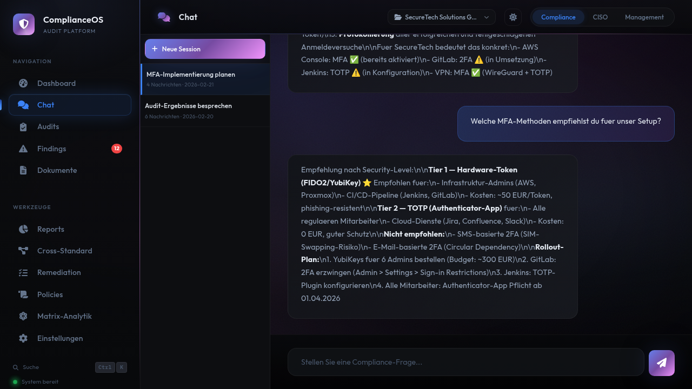

# Chat

Der KI-Chat ist Ihr persoenlicher Compliance-Berater. Stellen Sie Fragen zu Standards, lassen Sie Findings analysieren oder holen Sie sich Empfehlungen — alles im Kontext Ihrer aktuellen Compliance-Daten.

<figure class="screenshot" markdown>

<figcaption>Chat: Sessions-Liste links, Konversation rechts mit Streaming-Antworten</figcaption>
</figure>

!!! info "Voraussetzung"
    Der Chat erfordert eine aktive Claude AI Verbindung (siehe [Setup](../schnellstart/setup.md)).
    Ohne KI-Integration stehen vorgefertigte Antworten zu haeufigen Compliance-Fragen bereit (Builtin-Responses).

---

## Chat starten

1. Klicken Sie auf **Chat** in der Seitenleiste
2. Geben Sie Ihre Frage in das Eingabefeld ein
3. Druecken Sie ++enter++ oder klicken Sie auf **Senden**
4. Die Antwort wird in Echtzeit gestreamt (Wort fuer Wort)

Der Chat-Assistent hat Zugriff auf:

- Ihre aktuellen Audit-Ergebnisse und Findings
- Alle 9 unterstuetzten Standards und deren Anforderungen
- Ihre Projekt-Einstellungen und aktiven Standards
- Die Knowledge-Base mit 135 Controls und 2.042 AUDIT-CHECKs

---

## Intent-Erkennung

ComplianceOS erkennt automatisch 9 verschiedene Frage-Typen und passt die Antwort entsprechend an:

| Intent | Beschreibung | Beispiel-Fragen |
|--------|-------------|-----------------|
| **Audit** | Audit-bezogene Aktionen | "Starte einen Audit fuer die Domain CRYPTO" |
| **Findings** | Findings abfragen und analysieren | "Zeige mir alle offenen Major NCs", "Wie viele Findings hat NETWORK?" |
| **Standard** | Informationen zu Standards und Controls | "Was fordert ISO 27001 Annex A.8.24?", "Erklaere NIS2 Artikel 21" |
| **Policy** | Policy-Generierung und -Beratung | "Generiere eine Passwort-Richtlinie", "Was muss eine Backup-Policy enthalten?" |
| **Risk** | Risikobewertung und -analyse | "Wie hoch ist das Risiko bei fehlender Verschluesselung?" |
| **Report** | Report-Erstellung und -Interpretation | "Erstelle einen Executive Summary", "Fasse die Audit-Ergebnisse zusammen" |
| **Compare** | Vergleich von Audit-Laeufen | "Vergleiche die letzten zwei Audit-Laeufe", "Was hat sich seit Januar geaendert?" |
| **Help** | Hilfe zur Bedienung von ComplianceOS | "Wie funktioniert die Drift-Detection?", "Was bedeutet OFI?" |
| **General** | Allgemeine Compliance-Fragen | "Welche MFA-Methoden empfiehlst du?", "Was ist ein ISMS?" |

Der erkannte Intent bestimmt welche Daten der Assistent zusaetzlich laedt — bei einer Findings-Frage werden zum Beispiel automatisch die aktuellen Findings aus der Datenbank bereitgestellt.

---

## Sessions

Jede Konversation wird als **Session** gespeichert und kann spaeter fortgesetzt werden.

### Session-Liste

Auf der linken Seite des Chat-Bereichs sehen Sie alle gespeicherten Sessions:

- **Session-Titel**: Automatisch generiert aus der ersten Frage
- **Datum**: Wann die Session erstellt wurde
- **Vorschau**: Die letzten Nachrichten

### Session verwalten

| Aktion | Beschreibung |
|--------|-------------|
| **Neue Session** | Klick auf "Neue Konversation" startet eine frische Session |
| **Fortsetzen** | Klick auf eine bestehende Session oeffnet den Verlauf |
| **Loeschen** | Session entfernen (Daten werden aus der DB geloescht) |

!!! tip "Kontext-Erhaltung"
    Innerhalb einer Session bleiben fruehere Nachrichten im Kontext. Stellen Sie Folgefragen ohne den Kontext wiederholen zu muessen: "Und wie sieht das bei ISO 22301 aus?"

---

## Builtin-Responses

Auch ohne KI-Anbindung beantwortet ComplianceOS haeufige Compliance-Fragen mit vordefinierten Antworten:

- Erklaerungen zu Severity-Stufen (Major NC, Minor NC, Observation, OFI)
- Ueberblick ueber die 9 unterstuetzten Standards
- Beschreibung der 12 Sicherheitsdomains
- Grundlegende Compliance-Begriffe (ISMS, SoA, Control, etc.)

Die Builtin-Responses sind in der Datenbank hinterlegt und sofort verfuegbar — ohne Wartezeit und ohne externe Abhaengigkeit.

---

## Tipps fuer effektive Chat-Nutzung

!!! tip "Spezifische Fragen"
    Je spezifischer Ihre Frage, desto besser die Antwort. Statt "Wie ist mein Status?" fragen Sie: "Welche Major NCs hat die Domain CRYPTO und welche Massnahmen empfiehlst du?"

!!! tip "Standards referenzieren"
    Referenzieren Sie konkrete Controls oder Artikel: "Was fordert ISO 27001 A.8.24 zur Kryptografie?" — der Assistent kennt die vollstaendige Control-Beschreibung.

!!! tip "Kontext nutzen"
    Der Chat kennt Ihre aktuellen Audit-Ergebnisse. Fragen wie "Welche Bereiche sind am schwaechsten?" werden automatisch anhand Ihrer Daten beantwortet.

!!! tip "Aktions-Trigger"
    Bestimmte Fragen loesen Aktionen aus: "Starte einen Audit" oeffnet das Audit-Formular, "Generiere eine Policy" leitet zur Policy-Generierung weiter.

---

## Beispiel-Dialoge

### Standard-Frage

> **Sie:** "Was fordert ISO 27001 Annex A.8.24 zur Verschluesselung?"
>
> **Assistent:** Erklaert die Anforderungen des Controls mit Bezug auf Ihre aktuelle Implementierung und verweist auf relevante Findings.

### Findings-Analyse

> **Sie:** "Welche Controls sind in der Domain ACCESS nicht erfuellt?"
>
> **Assistent:** Analysiert Ihre aktuellen Findings und listet die betroffenen Controls mit Severity, Beschreibung und konkreten Empfehlungen auf.

### Vergleich

> **Sie:** "Erklaere mir den Unterschied zwischen ISO 27001 und NIS2"
>
> **Assistent:** Vergleicht die Standards hinsichtlich Geltungsbereich, Anforderungen und Ueberschneidungen — mit Bezug auf die in ComplianceOS abgebildeten Controls.

### Massnahmen-Beratung

> **Sie:** "Wie implementiere ich MFA am besten fuer unsere Umgebung?"
>
> **Assistent:** Gibt technische Empfehlungen basierend auf den Anforderungen der aktiven Standards und den bereits vorhandenen Controls.

---

## Video: Chat-Konversation

<video controls width="100%">
  <source src="../videos/chat-conversation.mp4" type="video/mp4">
  Ihr Browser unterstuetzt kein Video. <a href="../videos/chat-conversation.mp4">Video herunterladen</a>.
</video>

Das Video zeigt eine Chat-Konversation: Session-Verwaltung, Eingabe einer Compliance-Frage und Streaming-Antwort des Assistenten.
