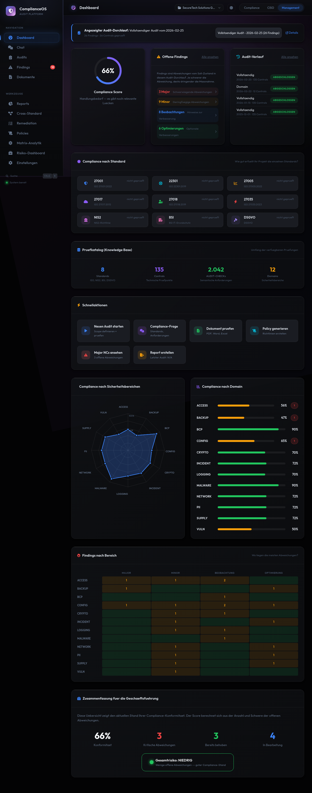

# Dashboard

Das Dashboard ist die Startseite von ComplianceOS und zeigt den gesamten Compliance-Status auf einen Blick. Es besteht aus mehreren Bereichen, die im Folgenden erklaert werden.

<figure class="screenshot" markdown>

<figcaption>Dashboard mit allen Bereichen: Score-Ring, Findings, Audit-Verlauf, Standards, Domain-Scores und Heatmap</figcaption>
</figure>

---

## Drei Ansichten

Das Dashboard bietet drei Ansichten fuer unterschiedliche Rollen. Der Wechsel erfolgt ueber die Tabs in der Kopfzeile:

| Ansicht | Zielgruppe | Fokus |
|---------|-----------|-------|
| **Compliance** | Compliance-Beauftragte | Vollstaendiger technischer Ueberblick, alle Bereiche |
| **CISO** | IT-Sicherheitsverantwortliche | Technisches Dashboard plus Risiko-Dashboard in der Sidebar |
| **Management** | Geschaeftsfuehrung | Komprimiertes Dashboard mit Zusammenfassung fuer die Geschaeftsfuehrung |

<figure class="screenshot" markdown>

<figcaption>Management-Ansicht: Komprimiertes Dashboard mit Zusammenfassung fuer die Geschaeftsfuehrung</figcaption>
</figure>

---

## Compliance-Score

Der zentrale **Score-Ring** zeigt den Gesamt-Compliance-Grad als Prozentwert. Unterhalb steht eine kurze Einstufung ("Handlungsbedarf", "Guter Zustand" etc.).

| Bereich | Farbe | Einstufung |
|---------|-------|-----------|
| 80-100% | Gruen | Guter Compliance-Stand |
| 60-79% | Gelb | Handlungsbedarf — relevante Luecken |
| 40-59% | Orange | Erheblicher Handlungsbedarf |
| 0-39% | Rot | Kritisch — sofortige Massnahmen erforderlich |

Der Score berechnet sich aus dem Verhaeltnis der als "compliant" bewerteten Controls zur Gesamtzahl der geprueften Controls, gewichtet nach Severity der Abweichungen.

---

## Offene Findings

Rechts neben dem Score-Ring zeigt der Bereich **Offene Findings** die Anzahl der Abweichungen nach Severity:

- **Major** (rot) — Schwerwiegende Nichtkonformitaeten mit Klick-Link zur Findings-Liste
- **Minor** (orange) — Geringfuegige Nichtkonformitaeten
- **Beobachtungen** (blau) — Hinweise auf Verbesserungspotenzial
- **Optimierungen** (lila) — Opportunities for Improvement

Jede Zeile ist klickbar und fuehrt direkt zur gefilterten Findings-Ansicht.

---

## Audit-Verlauf

Der Bereich **Audit-Verlauf** zeigt die letzten 4-5 Audit-Laeufe mit:

- Audit-Modus (Vollstaendig / Domain)
- Datum
- Anzahl Controls
- Status-Badge ("Abgeschlossen")

Klicken Sie auf einen Eintrag um zur Audit-Detail-Ansicht zu gelangen.

---

## Compliance nach Standard

Zeigt alle 9 unterstuetzten Standards als Kacheln mit ihrem jeweiligen Pruef-Status:

| Status | Bedeutung |
|--------|-----------|
| Gruen ("geprueft") | Mindestens ein Audit-Lauf hat diesen Standard abgedeckt |
| Grau ("nicht geprueft") | Noch kein Audit fuer diesen Standard durchgefuehrt |

---

## Pruefkatalog (Knowledge Base)

Zeigt vier Kennzahlen der integrierten Wissensbasis:

| Kennzahl | Beschreibung |
|----------|-------------|
| **Standards** | Anzahl der unterstuetzten Standards (9) |
| **Controls** | Technische Pruefpunkte (135) |
| **AUDIT-CHECKs** | Semantische Anforderungen (2.042) |
| **Domains** | Sicherheitsbereiche (12) |

---

## Schnellaktionen

Sechs Aktions-Kacheln fuer haeufige Aufgaben:

| Aktion | Beschreibung | Zielseite |
|--------|-------------|-----------|
| Neuen Audit starten | Scope definieren und Audit ausfuehren | `/audits` |
| Compliance-Frage | KI-Chat fuer Compliance-Beratung | `/chat` |
| Dokument pruefen | PDF, Word, Excel hochladen und analysieren | `/documents` |
| Policy generieren | Richtlinie aus Vorlage erstellen | `/policies` |
| Major NCs ansehen | Offene schwerwiegende Abweichungen | `/findings?severity=major_nc` |
| Report erstellen | Audit-Bericht generieren | `/reports` |

---

## Compliance nach Sicherheitsbereichen

Ein **Radar-Chart** zeigt die Compliance-Werte aller 12 Domains als Netzdiagramm. So erkennen Sie auf einen Blick, welche Bereiche stark sind und wo Luecken bestehen.

---

## Compliance nach Domain

Horizontale **Balken-Diagramme** zeigen den prozentualen Compliance-Grad jeder Domain. Domains mit Major NCs erhalten ein rotes Warnsymbol.

| Domain | Pruefbereich |
|--------|-------------|
| ACCESS | Zugriffskontrolle und Authentifizierung |
| BACKUP | Datensicherung und Wiederherstellung |
| BCP | Business Continuity Planning |
| CONFIG | Konfigurationsmanagement |
| CRYPTO | Verschluesselung und Kryptografie |
| INCIDENT | Incident Management |
| LOGGING | Protokollierung und Monitoring |
| MALWARE | Malware-Schutz |
| NETWORK | Netzwerksicherheit |
| PII | Personenbezogene Daten (Datenschutz) |
| SUPPLY | Lieferanten-Management |
| VULN | Schwachstellenmanagement |

---

## Findings nach Bereich (Heatmap)

Die **Heatmap** am unteren Rand zeigt die Verteilung der Findings nach Domain und Severity:

- Spalten: Major, Minor, Beobachtung, Optimierung
- Zeilen: Alle 12 Domains
- Farbe: Je dunkler, desto mehr Findings in dieser Kombination

So erkennen Sie sofort die Hotspots — Domains mit den meisten schwerwiegenden Findings.

---

## Audit-Run-Selektor

In der gelben Infobox oben koennen Sie den angezeigten Audit-Durchlauf wechseln. Das Dropdown zeigt alle verfuegbaren Runs mit Datum und Modus. Alle Dashboard-Werte aktualisieren sich entsprechend.

---

## Projekt wechseln

In der Kopfzeile befindet sich ein Dropdown mit dem aktuellen Projektnamen. Klicken Sie darauf um zwischen Projekten zu wechseln. Jedes Projekt hat eigene Audit-Ergebnisse, Findings und Einstellungen.
