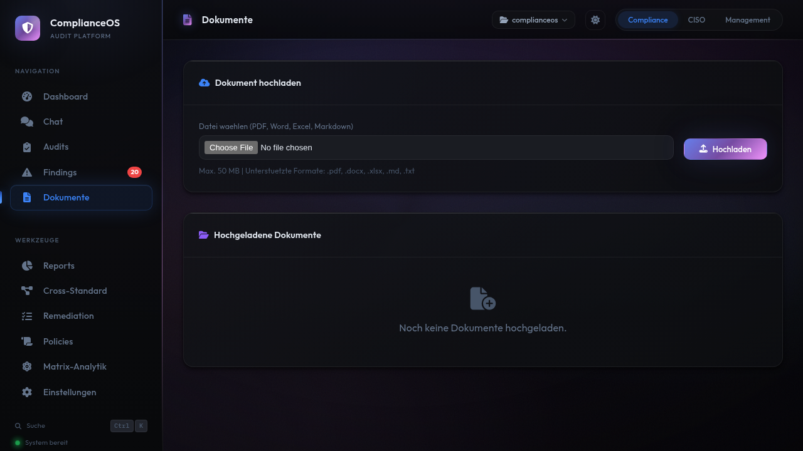

# Dokumente

Laden Sie bestehende Compliance-Dokumente hoch, um sie automatisch analysieren und mit Controls abgleichen zu lassen.

## Unterstuetzte Formate

| Format | Erweiterung | Beschreibung |
|--------|-------------|-------------|
| PDF | `.pdf` | Richtlinien, Zertifikate, Reports |
| Word | `.docx` | Policies, Verfahrensanweisungen |
| Excel | `.xlsx` | Massnahmenlisten, Asset-Register |
| Markdown | `.md` | Technische Dokumentation |
| Text | `.txt` | Konfigurationsdateien, Logs |

!!! info "PDF-Upload"
    Fuer PDF-Verarbeitung muss `ENABLE_PDF_UPLOAD=true` gesetzt sein (Standard).

## Dokument hochladen

1. Navigieren Sie zu **Dokumente** in der Seitenleiste
2. Klicken Sie auf **Hochladen**
3. Waehlen Sie eine oder mehrere Dateien aus
4. Der Upload und die Analyse starten automatisch

## Analyse

Nach dem Upload wird das Dokument automatisch:

1. **Geparst** — Text wird extrahiert
2. **Analysiert** — Inhalte werden mit Controls abgeglichen
3. **Zugeordnet** — Relevante Standards und Domains werden identifiziert

## Detailansicht

Ein Klick auf ein Dokument zeigt:

- **Metadaten:** Dateiname, Groesse, Upload-Datum, Format
- **Extrahierter Text:** Der vollstaendige Textinhalt
- **Analyse-Status:** Pending, Analysiert, Fehler

## Dokumente loeschen

Klicken Sie in der Detailansicht auf **Loeschen**. Geloeschte Dokumente koennen nicht wiederhergestellt werden.
