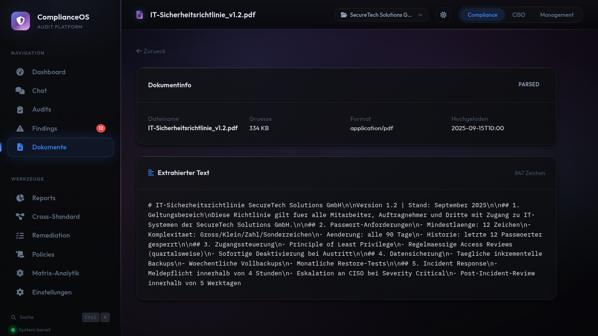

# Dokumente

Laden Sie bestehende Compliance-Dokumente hoch, um sie automatisch analysieren und mit Controls abgleichen zu lassen. ComplianceOS extrahiert Textinhalte aus fünf Formaten und ordnet sie den relevanten Standards und Domains zu.

<figure class="screenshot" markdown>

<figcaption>Dokumente: Upload-Bereich oben, hochgeladene Dokumente mit Status und Metadaten unten</figcaption>
</figure>

---

## Unterstützte Formate

ComplianceOS verarbeitet fünf gängige Dokumentformate:

| Format | Erweiterung | Parser | Typische Inhalte |
|--------|-------------|--------|-----------------|
| **PDF** | `.pdf` | PyMuPDF | Richtlinien, Zertifikate, Audit-Reports, Compliance-Nachweise |
| **Word** | `.docx` | python-docx | Policies, Verfahrensanweisungen, Betriebshandbücher |
| **Excel** | `.xlsx` | openpyxl | Massnahmenlisten, Asset-Register, Risikoanalysen |
| **Markdown** | `.md` | Direkt | Technische Dokumentation, Konfigurationsbeschreibungen |
| **Text** | `.txt` | Direkt | Konfigurationsdateien, Logs, Notizen |

!!! info "PDF-Upload"
    Für PDF-Verarbeitung muss das Feature-Flag `ENABLE_PDF_UPLOAD=true` gesetzt sein (Standard: aktiviert). Sie können dies unter **Einstellungen > Feature Flags** prüfen.

---

## Dokument hochladen

1. Navigieren Sie zu **Dokumente** in der Seitenleiste
2. Klicken Sie auf den **Upload-Bereich** oder ziehen Sie Dateien per Drag & Drop hinein
3. Wählen Sie eine oder mehrere Dateien aus
4. Der Upload und die automatische Analyse starten sofort

### Parser-Pipeline

Nach dem Upload durchläuft jedes Dokument eine automatische Verarbeitungspipeline:

| Schritt | Beschreibung | Dauer |
|---------|-------------|-------|
| **1. Upload** | Datei wird auf dem Server gespeichert | Sofort |
| **2. Parsing** | Text wird aus dem Dokument extrahiert | 1-5 Sekunden |
| **3. Analyse** | Inhalte werden mit Controls abgeglichen | 2-10 Sekunden |
| **4. Zuordnung** | Relevante Standards und Domains werden identifiziert | 1-2 Sekunden |

Der Fortschritt wird durch den Analyse-Status angezeigt:

- **Pending**: Upload erfolgreich, Analyse läuft
- **Analysiert**: Verarbeitung abgeschlossen
- **Fehler**: Problem bei der Verarbeitung (z.B. geschütztes PDF)

---

## Dokumente-Übersicht

Die Übersicht listet alle hochgeladenen Dokumente mit:

| Spalte | Beschreibung |
|--------|-------------|
| **Dateiname** | Name der hochgeladenen Datei |
| **Format** | Erkannter Dateityp (PDF, DOCX, XLSX, MD, TXT) |
| **Grösse** | Dateigrösse |
| **Upload-Datum** | Zeitpunkt des Uploads |
| **Status** | Analyse-Status (Pending, Analysiert, Fehler) |

Klicken Sie auf ein Dokument um die Detailansicht zu öffnen.

---

## Detailansicht

Die Detailansicht zeigt alle Informationen zu einem hochgeladenen Dokument:

<figure class="screenshot" markdown>

<figcaption>Dokument-Detail: Metadaten, Analyse-Status und extrahierter Textinhalt</figcaption>
</figure>

### Metadaten

| Feld | Beschreibung |
|------|-------------|
| **Dateiname** | Originaler Dateiname |
| **Format** | Erkannter Dateityp |
| **Grösse** | Dateigrösse in KB/MB |
| **Upload-Datum** | Zeitpunkt des Uploads |
| **Analyse-Status** | Aktueller Verarbeitungsstand |

### Extrahierter Text

Der vollständige extrahierte Textinhalt wird angezeigt. Bei PDF- und Word-Dokumenten wird die Formatierung so weit wie möglich beibehalten.

---

## Dokument löschen

1. Öffnen Sie das Dokument in der Detailansicht
2. Klicken Sie auf **Löschen**
3. Bestätigen Sie die Aktion

!!! warning "Unwiderruflich"
    Gelöschte Dokumente können nicht wiederhergestellt werden. Die Datei wird sowohl aus der Datenbank als auch vom Dateisystem entfernt.

---

## Tipps zur Dokumentenverwaltung

!!! tip "Vor dem Audit hochladen"
    Laden Sie relevante Dokumente (Policies, Betriebshandbücher, Konfigurationen) **vor** einem Audit hoch. So kann die Audit-Engine die Dokumente als zusätzliche Evidenz heranziehen.

!!! tip "Aktualität"
    Halten Sie die hochgeladenen Dokumente aktuell. Veraltete Policies oder abgelaufene Zertifikate können zu falschen Audit-Ergebnissen führen.

!!! tip "Benennungskonvention"
    Verwenden Sie aussagekräftige Dateinamen wie `passwort-richtlinie-v2.1.pdf` statt `dokument1.pdf`. Die Dateinamen werden in der Übersicht und in Findings als Referenz angezeigt.
