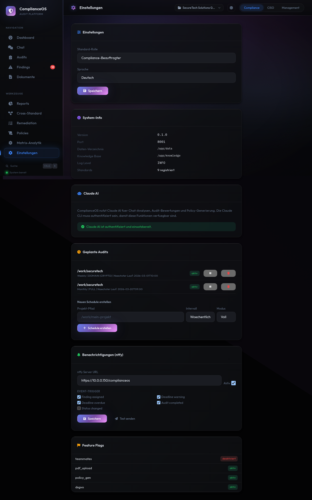

# Einstellungen

Unter Einstellungen verwalten Sie Projekte, Praeferenzen und System-Informationen.

## Praeferenzen

- **Sprache:** Deutsch oder Englisch
- **Rolle:** Bestimmt die Standard-Perspektive (Compliance, CISO, Management)
- **Theme:** Dark (Standard)

## Projekte

### Neues Projekt anlegen

1. Klicken Sie auf **Neues Projekt**
2. Geben Sie Name und Beschreibung ein
3. Optional: Pfad zum zu pruefenden System
4. Klicken Sie auf **Erstellen**

### Projekt wechseln

Klicken Sie oben rechts auf den Projektnamen und waehlen Sie ein anderes Projekt. Alle Ansichten (Dashboard, Findings, etc.) wechseln zum ausgewaehlten Projekt.

### Projekt-Isolation

Jedes Projekt hat eigene:

- Audit-Laeufe und Findings
- Chat-Sessions
- Dokumente und Policies
- Remediation-Aufgaben
- Risikobewertungen

## Team-Mitglieder

Legen Sie Mitarbeiter an, die als Verantwortliche fuer Remediation-Aufgaben zugewiesen werden koennen:

- **Name** (Pflichtfeld)
- **E-Mail** (optional)
- **Rolle** (compliance, ciso, management)

## Geplante Audits

Richten Sie automatische Audit-Laeufe ein:

1. Klicken Sie auf **Neuer Zeitplan**
2. Waehlen Sie Modus (Vollaudit / Domain)
3. Waehlen Sie Intervall (taeglich / woechentlich / monatlich)
4. Aktivieren Sie den Zeitplan

## System-Info

Zeigt technische Informationen:

- ComplianceOS-Version
- Python-Version
- Datenbankgroesse
- Anzahl Controls, Standards, Domains
- Aktivierte Feature-Flags
