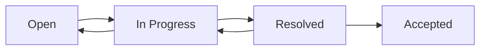

# Findings

Findings sind die Ergebnisse eines Audits — identifizierte Abweichungen, Beobachtungen und Verbesserungsmoeglichkeiten.

## Findings-Browser

Die Findings-Uebersicht zeigt alle Findings des aktuellen Projekts mit Filter- und Sortieroptionen.

### Filter

- **Severity:** Major NC, Minor NC, Observation, OFI
- **Domain:** CRYPTO, ACCESS, BACKUP, LOGGING, etc.
- **Status:** Open, In Progress, Resolved, Accepted
- **Audit-Lauf:** Ergebnisse eines bestimmten Audits

### Severity-Stufen

| Severity | Bedeutung | Handlungsbedarf |
|----------|-----------|-----------------|
| **Major NC** | Schwerwiegende Nichtkonformitaet | Sofortiger Handlungsbedarf |
| **Minor NC** | Geringfuegige Nichtkonformitaet | Zeitnahe Behebung |
| **Observation** | Beobachtung | Verbesserungspotenzial |
| **OFI** | Opportunity for Improvement | Optional |

## Finding-Detail

Ein Klick auf ein Finding oeffnet die Detailansicht mit:

- **Beschreibung:** Was wurde festgestellt
- **Empfehlung:** Wie die Abweichung behoben werden kann
- **Evidence:** Technische Belege (Konfigurationen, Logs, etc.)
- **Reasoning:** Begruendung der Bewertung
- **Control-Referenz:** Zugehoeriger Standard und Control
- **Confidence:** Zuverlaessigkeit der automatischen Bewertung (0-100%)

## Status-Workflow

Jedes Finding durchlaeuft einen definierten Lebenszyklus:

1. **Open** — Finding wurde identifiziert
2. **In Progress** — Massnahme wird umgesetzt
3. **Resolved** — Massnahme wurde umgesetzt, wartet auf Verifikation
4. **Accepted** — Finding wurde verifiziert und akzeptiert

## CSV-Export

Klicken Sie auf **Export** um die aktuelle Findings-Liste als CSV-Datei herunterzuladen. Der Export beruecksichtigt die aktiven Filter.
