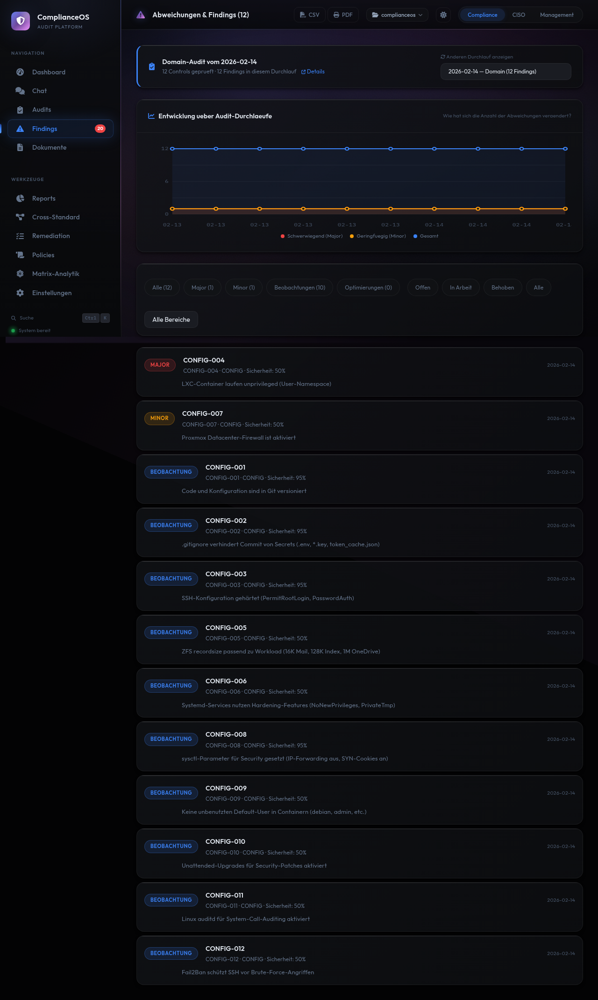
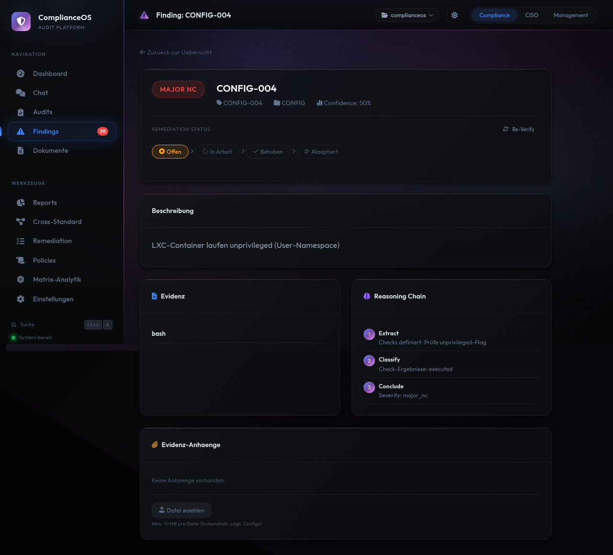

# Findings

Findings sind die Ergebnisse eines Audits — identifizierte Abweichungen, Beobachtungen und Verbesserungsmöglichkeiten. ComplianceOS erfasst jedes Finding mit Beschreibung, Evidenz, Begründung und Empfehlung.

---

## Findings-Browser

Die Findings-Übersicht zeigt alle Findings des aktuellen Projekts mit umfangreichen Filter- und Sortieroptionen.

<figure class="screenshot" markdown>

<figcaption>Findings-Browser: Trend-Diagramm, Filter-Leiste und Findings-Liste mit Severity-Badges</figcaption>
</figure>

### Trend-Diagramm

Am oberen Rand zeigt ein **Findings-Trend-Diagramm** die Entwicklung der Findings über die letzten Audit-Läufe. So erkennen Sie auf einen Blick ob sich Ihr Compliance-Zustand verbessert oder verschlechtert.

### Filter

Die Filter-Leiste ermöglicht es, die Findings-Liste gezielt einzuschränken:

| Filter | Optionen | Beschreibung |
|--------|----------|-------------|
| **Severity** | Major NC, Minor NC, Observation, OFI | Nach Schweregrad filtern |
| **Domain** | ACCESS, BACKUP, BCP, CONFIG, CRYPTO, INCIDENT, LOGGING, MALWARE, NETWORK, PII, SUPPLY, VULN | Nach Sicherheitsbereich |
| **Status** | Offen, In Arbeit, Behoben, Akzeptiert | Nach Bearbeitungsstand |
| **Audit-Lauf** | Run-IDs (z.B. run-st-2026-02) | Findings eines bestimmten Audits |

Mehrere Filter können kombiniert werden. Die Ergebnisliste aktualisiert sich sofort bei jeder Filteränderung.

### Findings-Liste

Jedes Finding wird in der Liste dargestellt mit:

- **Severity-Badge** (farbcodiert: rot, orange, blau, lila)
- **Control-ID** (z.B. CRYPTO-001, ACCESS-003)
- **Titel** der Abweichung
- **Domain** des zugehörigen Controls
- **Status** des Findings

Klicken Sie auf ein Finding um die Detailansicht zu öffnen.

---

## Severity-Stufen

ComplianceOS klassifiziert jedes Finding in eine von vier Severity-Stufen:

| Severity | Badge | Bedeutung | Handlungsbedarf | Typisches Beispiel |
|----------|-------|-----------|-----------------|-------------------|
| **Major NC** | MAJOR NC | Schwerwiegende Nichtkonformität | Sofortige Massnahme erforderlich | Keine Verschlüsselung für Daten in Transit |
| **Minor NC** | MINOR NC | Geringfügige Nichtkonformität | Behebung innerhalb definierter Frist | Passwort-Policy erlaubt 6 statt 12 Zeichen |
| **Observation** | OBSERVATION | Beobachtung | Verbesserungspotenzial prüfen | MFA empfohlen, aber nicht konfiguriert |
| **OFI** | OFI | Opportunity for Improvement | Optional, Best Practice | Automatisiertes Key-Rotation einrichten |

### Severity-Regeln

Die Severity wird nach folgenden Kriterien vergeben:

- **Major NC**: Fehlende oder nicht wirksame Sicherheitsmassnahme die ein direktes Risiko darstellt
- **Minor NC**: Massnahme vorhanden aber nicht vollständig oder nicht konform mit den Anforderungen
- **Observation**: Massnahme vorhanden, aber Verbesserungspotenzial identifiziert
- **OFI**: Best Practice die über die Anforderungen hinausgeht

!!! info "Fehlende Evidenz"
    Wenn ein Control nicht geprüft werden kann weil keine Evidenz vorliegt, wird es als **Minor NC** klassifiziert — nicht als compliant. Fehlende Nachweise werden nie als konform bewertet.

---

## Finding-Detail

Ein Klick auf ein Finding öffnet die ausführliche Detailansicht:

<figure class="screenshot" markdown>

<figcaption>Finding-Detail: Beschreibung, Empfehlung, Evidenz-Dateien und Reasoning Chain der KI-Bewertung</figcaption>
</figure>

### Bereiche der Detailansicht

| Bereich | Inhalt |
|---------|--------|
| **Beschreibung** | Was wurde festgestellt — klare Darstellung der Abweichung |
| **Empfehlung** | Konkrete Handlungsempfehlung zur Behebung |
| **Evidence** | Technische Belege: Dateipfade, Konfigurationsauszüge, Log-Einträge |
| **Reasoning Chain** | Nachvollziehbare Begründungskette der KI-Bewertung |
| **Control-Referenz** | Zugehöriger Standard (z.B. ISO 27001 A.8.24) und Control-ID |
| **Confidence** | Zuverlässigkeit der automatischen Bewertung (0-100%) |
| **Standards** | Alle Standards die diesen Control referenzieren (Cross-Standard-Mapping) |

### Evidence verstehen

Die Evidence-Sektion zeigt welche Dateien und Konfigurationen geprüft wurden:

- **Dateipfade**: Welche Dateien im Projekt analysiert wurden
- **Konfigurationsauszüge**: Relevante Konfigurationseinstellungen
- **Log-Einträge**: Auffällige Log-Meldungen
- **Fehlende Artefakte**: Erwartete Dateien die nicht gefunden wurden

### Reasoning Chain

Die Reasoning Chain macht die KI-Bewertung nachvollziehbar. Sie zeigt Schritt für Schritt:

1. Welche Anforderung der Control stellt
2. Welche Evidenz gefunden wurde
3. Wie die Evidenz bewertet wurde
4. Warum die gewählte Severity vergeben wurde

!!! tip "Confidence-Wert"
    Der Confidence-Wert zeigt wie sicher die automatische Bewertung ist. Bei Werten unter 60% empfiehlt sich eine manuelle Überprüfung des Findings.

---

## Status-Workflow

Jedes Finding durchläuft einen definierten Lebenszyklus:

### Status-Bedeutung

| Status | Beschreibung | Nächster Schritt |
|--------|-------------|-------------------|
| **Offen** | Finding wurde identifiziert, noch keine Massnahme begonnen | Massnahme planen und zuweisen |
| **In Arbeit** | Massnahme wird aktiv umgesetzt | Nach Abschluss auf "Behoben" setzen |
| **Behoben** | Massnahme wurde umgesetzt, wartet auf Verifikation | Domain-Audit zur Verifikation durchführen |
| **Akzeptiert** | Finding verifiziert und abgeschlossen | Keine weitere Aktion erforderlich |

### Status ändern

In der Finding-Detailansicht finden Sie im Bereich **Remediation-Status** Buttons für jeden möglichen Status-Übergang:

1. Öffnen Sie das Finding in der Detailansicht
2. Klicken Sie auf den gewünschten Status-Button
3. Der Status wird sofort aktualisiert

!!! warning "Zurücksetzen"
    Findings können auch zurückgesetzt werden: "Behoben" zurück auf "In Arbeit" oder "In Arbeit" zurück auf "Offen". Dies ist nützlich wenn sich herausstellt dass eine Massnahme nicht ausreichend war.

---

## Remediation-Tracking

ComplianceOS bietet integriertes Massnahmen-Tracking direkt aus den Findings heraus. Für eine ausführliche Beschreibung der Remediation-Funktionen siehe [Remediation](remediation.md).

### Priorität und Zuweisung

Für jedes Finding können Sie festlegen:

- **Priorität**: Kritisch, Hoch, Mittel, Niedrig
- **Zuständiger**: Teammitglied das die Massnahme umsetzt
- **Fälligkeitsdatum**: Deadline für die Behebung

### Ansichten

Die Remediation-Übersicht bietet drei Ansichten:

| Ansicht | Beschreibung | Beste für |
|---------|-------------|------------|
| **Kanban** | Spalten nach Status (Offen, In Arbeit, Behoben, Akzeptiert) | Visuelles Tracking, Statusüberblick |
| **Liste** | Tabellarische Ansicht mit Sortierung | Detaillierte Analyse, Priorisierung |
| **Kalender** | Findings nach Fälligkeitsdatum | Deadline-Management |

---

## CSV-Export

Klicken Sie auf **Export** um die aktuelle Findings-Liste als CSV-Datei herunterzuladen.

Der Export:

- Berücksichtigt die aktiven Filter
- Enthält alle sichtbaren Findings
- Eignet sich für Weiterverarbeitung in Excel oder Import in Ticketing-Systeme
- Enthält: Finding-ID, Control-ID, Severity, Domain, Status, Beschreibung, Empfehlung

!!! tip "Export-Tipp"
    Setzen Sie vor dem Export die gewünschten Filter. So exportieren Sie zum Beispiel nur die offenen Major NCs einer bestimmten Domain.

---

## Tipps zum Umgang mit Findings

!!! tip "Priorisierung"
    Beginnen Sie immer mit den **Major NCs** — diese stellen die grössten Risiken dar. Minor NCs sollten innerhalb einer definierten Frist (z.B. 90 Tage) behoben werden. Observations und OFIs können in die langfristige Planung aufgenommen werden.

!!! tip "Cross-Standard-Referenz"
    Viele Findings betreffen Controls die von mehreren Standards referenziert werden. Prüfen Sie in der Finding-Detailansicht den Bereich "Standards" um zu sehen welche Standards betroffen sind. Eine Massnahme kann so mehrere Standards gleichzeitig abdecken.

!!! tip "Verifikation"
    Nach Behebung einer Massnahme führen Sie einen [Domain-Audit](audits.md) durch um die Wirksamkeit zu prüfen. Erst wenn der Domain-Audit das Finding nicht mehr identifiziert, sollte der Status auf "Akzeptiert" gesetzt werden.

---

## Video: Finding-Lifecycle

<video controls width="100%">
  <source src="../videos/finding-lifecycle.mp4" type="video/mp4">
  Ihr Browser unterstützt kein Video. <a href="../videos/finding-lifecycle.mp4">Video herunterladen</a>.
</video>

Das Video zeigt den kompletten Finding-Lifecycle: Vom Findings-Browser über die Detail-Ansicht mit Evidence und Reasoning bis zur Statusänderung und Remediation-Zuweisung.
