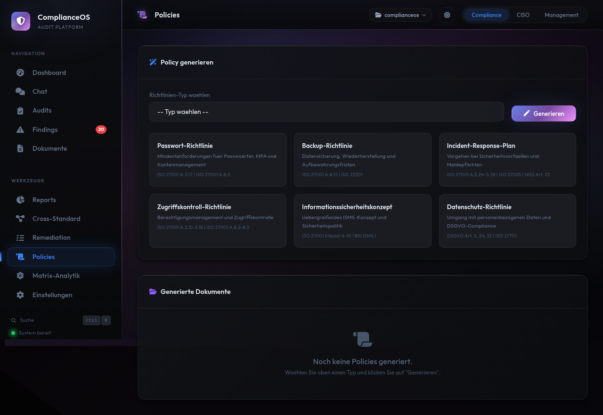

# Policies

ComplianceOS generiert Richtlinien-Dokumente aus Vorlagen, abgestimmt auf die Anforderungen der aktiven Standards. Sechs Vorlagen decken die wichtigsten Compliance-Bereiche ab.

<figure class="screenshot" markdown>

<figcaption>Policies: 6 Vorlagen mit Standard-Badges und generierte Dokumente in der Übersicht</figcaption>
</figure>

---

## Verfügbare Vorlagen

ComplianceOS stellt sechs Policy-Vorlagen bereit. Jede Vorlage ist mit den relevanten Standards verknüpft:

| Vorlage | Beschreibung | Standards |
|---------|-------------|-----------|
| **Passwort-Richtlinie** | Passwort-Anforderungen, Komplexität, MFA, Kontosperrung, Passwort-Manager | ISO 27001, NIS2, BSI |
| **Backup-Richtlinie** | Sicherungsintervalle, Aufbewahrungsfristen, Recovery-Tests, 3-2-1-Regel | ISO 27001, ISO 22301, BSI |
| **Incident-Richtlinie** | Meldewege, Eskalationsstufen, Reaktionszeiten, Dokumentation, Lessons Learned | ISO 27001, ISO 27035, NIS2 |
| **Zugriffs-Richtlinie** | Least Privilege, rollenbasierte Zugriffskontrolle, Access Reviews, Offboarding | ISO 27001, NIS2, DSGVO |
| **ISMS-Richtlinie** | Informationssicherheits-Managementsystem, Geltungsbereich, Verantwortlichkeiten | ISO 27001, ISO 27005, NIS2 |
| **Datenschutz-Richtlinie** | DSGVO-Anforderungen, Verarbeitungstätigkeiten, Betroffenenrechte, TOM | DSGVO, ISO 27018, NIS2 |

### Standard-Badges

Bei jeder Vorlage zeigen **Standard-Badges** welche Standards die Policy abdeckt. So erkennen Sie auf einen Blick welche Standards von der jeweiligen Richtlinie profitieren.

---

## Policy generieren

### Schritt-für-Schritt

1. Navigieren Sie zu **Policies** in der Seitenleiste
2. Wählen Sie eine Vorlage aus den 6 verfügbaren Karten
3. Klicken Sie auf **Generieren**
4. Die Generierung startet — bei KI-Unterstützung wird die Policy kontextbezogen erstellt
5. Nach Abschluss werden Sie zur Detailansicht weitergeleitet

### Mit und ohne KI

| Modus | Beschreibung | Ergebnis |
|-------|-------------|----------|
| **Mit Claude AI** | KI generiert die Policy basierend auf Ihren Audit-Ergebnissen, Findings und Projektkontext | Kontextbezogene Policy mit spezifischen Empfehlungen |
| **Ohne KI** | Statische Vorlage aus dem Template-Registry | Allgemeine Best-Practice-Policy |

!!! info "Feature Flag"
    Die KI-gestützte Policy-Generierung erfordert `ENABLE_POLICY_GEN=true` (Standard: aktiviert) und eine aktive Claude AI Verbindung.

---

## Policy-Detailansicht

Generierte Policies werden als formatiertes Markdown angezeigt:

<figure class="screenshot" markdown>

<figcaption>Policy-Detail: Metadaten und Markdown-gerenderte Passwort-Richtlinie</figcaption>
</figure>

### Struktur einer generierten Policy

Jede Policy enthält standardisierte Abschnitte:

| Abschnitt | Inhalt |
|-----------|--------|
| **Geltungsbereich** | Für wen und was die Richtlinie gilt |
| **Verantwortlichkeiten** | Wer für Umsetzung und Kontrolle zuständig ist |
| **Anforderungen** | Konkrete technische und organisatorische Massnahmen |
| **Standard-Referenzen** | Zuordnung zu ISO, NIS2, BSI, DSGVO Controls |
| **Inkrafttreten** | Datum und Review-Zyklus |
| **Versionshistorie** | Änderungsprotokoll |

### Metadaten

In der Detailansicht sehen Sie zusätzlich:

- **Vorlage**: Welche Vorlage als Basis diente
- **Erstellungsdatum**: Wann die Policy generiert wurde
- **Generierungsmethode**: KI oder Template
- **Wortanzahl**: Umfang des Dokuments

---

## Vorlagen im Detail

### Passwort-Richtlinie

Deckt ab: Minimale Passwortlänge (mind. 12 Zeichen), Komplexitätsanforderungen, MFA-Pflicht, Kontosperrung nach Fehlversuchen, Passwort-Manager-Empfehlung, Verbot von Passwort-Wiederverwendung.

**Relevante Controls:** ACCESS-001, ACCESS-002, ACCESS-003

### Backup-Richtlinie

Deckt ab: Sicherungsintervalle (RPO), Aufbewahrungsfristen, 3-2-1-Regel (3 Kopien, 2 Medien, 1 Offsite), Recovery-Tests (RTO-Validierung), Verschlüsselung von Backups.

**Relevante Controls:** BACKUP-001 bis BACKUP-010

### Incident-Richtlinie

Deckt ab: Meldewege und Eskalationsstufen, Reaktionszeiten nach Severity, Dokumentationspflichten, NIS2-Meldefristen (24h/72h), Lessons Learned Prozess.

**Relevante Controls:** INCIDENT-001 bis INCIDENT-011

### Zugriffs-Richtlinie

Deckt ab: Least-Privilege-Prinzip, rollenbasierte Zugriffskontrolle (RBAC), regelmässige Access Reviews, Onboarding/Offboarding-Prozesse, Privileged Access Management.

**Relevante Controls:** ACCESS-004 bis ACCESS-015

### ISMS-Richtlinie

Deckt ab: Geltungsbereich des ISMS, Sicherheitsziele, Rollen und Verantwortlichkeiten, Risikomanagement-Prozess, Kontinuierliche Verbesserung (PDCA).

**Relevante Controls:** Alle Domains (übergreifend)

### Datenschutz-Richtlinie

Deckt ab: Verzeichnis der Verarbeitungstätigkeiten, Betroffenenrechte (Auskunft, Löschung, Portabilität), technische und organisatorische Massnahmen (TOM), Datenschutz-Folgenabschätzung, Auftragsverarbeitung.

**Relevante Controls:** PII-001 bis PII-010

---

## Policies verwalten

### Generierte Dokumente

Alle generierten Policies werden in der Datenbank gespeichert und in der Übersicht aufgelistet:

- **Titel** der Policy
- **Vorlage** die als Basis diente
- **Erstellungsdatum**
- **Standard-Badges** der abgedeckten Standards

### Policies als Grundlage nutzen

Die generierten Policies sind **Vorlagen** die an Ihre Organisation angepasst werden müssen:

1. Generieren Sie die Policy in ComplianceOS
2. Lesen Sie den Inhalt in der Detailansicht
3. Kopieren Sie den Markdown-Text
4. Passen Sie ihn an Ihre spezifischen Anforderungen an
5. Lassen Sie die finale Policy von der Geschäftsführung freigeben

!!! warning "Anpassung erforderlich"
    Generierte Policies sind Ausgangspunkte, keine fertigen Dokumente. Sie müssen an Ihre Organisationsstruktur, vorhandene Prozesse und spezifische Anforderungen angepasst werden.

!!! tip "Coverage prüfen"
    Unter [Reports > Cross-Standard-Mapping](reports.md) sehen Sie welche Standards bereits durch Policies abgedeckt sind und wo noch Lücken bestehen.

---

## Video: Policy-Generierung

<video controls width="100%">
  <source src="../videos/policy-generation.mp4" type="video/mp4">
  Ihr Browser unterstützt kein Video. <a href="../videos/policy-generation.mp4">Video herunterladen</a>.
</video>

Das Video zeigt die Policy-Generierung: Template-Auswahl, Konfiguration der Parameter, Generierungsprozess und die fertige Policy in der Detail-Ansicht mit Markdown-Rendering.
