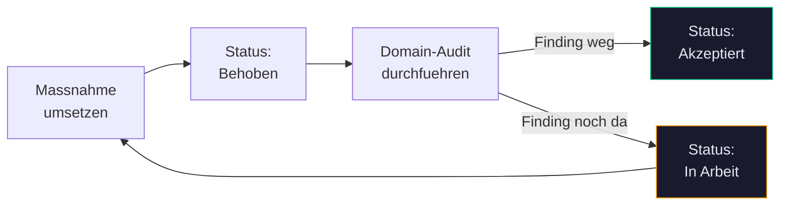

# Remediation

Das Remediation-Modul hilft Ihnen, Massnahmen zur Behebung von Findings zu planen, zuzuweisen und nachzuverfolgen. Drei Ansichten bieten unterschiedliche Perspektiven auf den Fortschritt.

---

## Kanban-Board

Die Standard-Ansicht zeigt ein **Kanban-Board** mit vier Spalten:

<figure class="screenshot" markdown>

<figcaption>Kanban-Board: Findings nach Status sortiert mit Severity-Badges, Prioritaet und Burndown-Chart</figcaption>
</figure>

| Spalte | Bedeutung | Farbe |
|--------|-----------|-------|
| **Offen** | Finding identifiziert, noch keine Massnahme begonnen | Rot |
| **In Arbeit** | Massnahme wird aktiv umgesetzt | Orange |
| **Behoben** | Massnahme umgesetzt, wartet auf Verifikation | Blau |
| **Akzeptiert** | Verifiziert und abgeschlossen | Gruen |

Jede Karte zeigt:

- **Severity-Badge** (Major NC, Minor NC, Observation, OFI)
- **Control-ID** und Kurztitel
- **Prioritaet** (Critical, High, Medium, Low)
- **Zustaendiger** (wenn zugewiesen)
- **Deadline** (wenn gesetzt)

### Burndown-Chart

Unterhalb des Kanban-Boards zeigt der **Burndown-Chart** den Fortschritt ueber die Zeit:

- **X-Achse**: Zeitverlauf (Tage/Wochen)
- **Y-Achse**: Anzahl offener Findings
- **Trend-Linie**: Zeigt ob Sie auf Kurs sind

---

## Listen-Ansicht

Die Listen-Ansicht zeigt alle Findings als sortierbare Tabelle:

<figure class="screenshot" markdown>

<figcaption>Listen-Ansicht: Tabellarische Darstellung mit Severity, Domain, Status, Prioritaet und Deadline</figcaption>
</figure>

| Spalte | Beschreibung | Sortierbar |
|--------|-------------|------------|
| **Severity** | Schweregrad des Findings | Ja |
| **Control** | Control-ID und Kurzname | Ja |
| **Domain** | Sicherheitsbereich | Ja |
| **Status** | Aktueller Bearbeitungsstand | Ja |
| **Prioritaet** | Zugewiesene Prioritaet | Ja |
| **Zustaendiger** | Verantwortliche Person | Ja |
| **Deadline** | Faelligkeitsdatum | Ja |

Die Listen-Ansicht eignet sich besonders fuer:

- Sortierung nach Prioritaet oder Deadline
- Schnellen Ueberblick ueber alle offenen Massnahmen
- Export-Vorbereitung (CSV)

---

## Kalender-Ansicht

Die Kalender-Ansicht zeigt Findings nach ihrem Faelligkeitsdatum:

<figure class="screenshot" markdown>

<figcaption>Kalender-Ansicht: Findings mit Deadlines im Monatskalender und Burndown-Chart</figcaption>
</figure>

- **Monats-Kalender** mit farbcodierten Findings an ihren Deadlines
- **Severity-Farben** zur schnellen Erkennung von Major NCs
- **Burndown-Chart** auch in der Kalender-Ansicht verfuegbar

!!! tip "Deadline-Management"
    Die Kalender-Ansicht hilft bei der Planung: Sehen Sie auf einen Blick welche Deadlines in den naechsten Wochen anstehen und ob Engpaesse drohen.

---

## Massnahme erstellen und zuweisen

### Aus der Finding-Detailansicht

1. Oeffnen Sie ein Finding in der Detailansicht
2. Im Bereich **Remediation-Status** sehen Sie die aktuellen Zuweisungen
3. Setzen Sie:
      - **Verantwortlich**: Name der zustaendigen Person
      - **Prioritaet**: Critical, High, Medium oder Low
      - **Deadline**: Faelligkeitsdatum
      - **Geschaetzter Aufwand**: In Stunden
4. Klicken Sie auf **Speichern**

### Prioritaeten und Fristen

| Prioritaet | Farbe | Ziel-Behebungszeit | Empfohlener Einsatz |
|-----------|-------|-------------------|-------------------|
| **Critical** | Rot | 7 Tage | Major NCs mit direktem Risiko |
| **High** | Orange | 30 Tage | Major NCs, sicherheitskritische Minor NCs |
| **Medium** | Gelb | 90 Tage | Minor NCs, wichtige Observations |
| **Low** | Grau | Nach Bedarf | OFIs, optionale Verbesserungen |

!!! warning "Major NCs"
    Major NCs sollten immer mindestens als **High** priorisiert werden. Bei direkter Gefahrenlage ist **Critical** angemessen.

---

## Verifikation

Nach Abschluss einer Massnahme folgt die Verifikation:

1. **Massnahme umsetzen**: Technische oder organisatorische Aenderung durchfuehren
2. **Status auf "Behoben" setzen**: Signalisiert dass die Massnahme abgeschlossen ist
3. **Domain-Audit durchfuehren**: Gezielter Nachtest der betroffenen Domain
4. **Ergebnis pruefen**:
      - Finding nicht mehr vorhanden → Status auf **"Akzeptiert"** setzen
      - Finding weiterhin vorhanden → Status zurueck auf **"In Arbeit"** mit Kommentar

---

## Team-Mitglieder

Unter **Einstellungen > Team** koennen Sie Mitarbeiter anlegen die als Verantwortliche fuer Findings zugewiesen werden koennen:

- **Name**: Anzeigename im System
- **Rolle**: Position oder Funktion
- **E-Mail**: Fuer Benachrichtigungen (optional)

Die angelegten Teammitglieder stehen dann im Dropdown "Verantwortlich" bei jedem Finding zur Verfuegung.

---

## Aktivitaets-Log

Jede Statusaenderung wird im Aktivitaets-Log des Findings protokolliert:

- **Zeitstempel**: Wann die Aenderung erfolgte
- **Akteur**: Wer die Aenderung vorgenommen hat
- **Aktion**: Was geaendert wurde (Status, Prioritaet, Zuweisung)
- **Kommentar**: Optionale Begruendung

Das Log bietet eine lueckenlose Nachverfolgbarkeit — wichtig fuer externe Audits und Compliance-Nachweise.

---

## Tipps fuer effektives Remediation-Tracking

!!! tip "Priorisierung"
    Beginnen Sie mit Major NCs und arbeiten Sie sich nach unten vor. Nutzen Sie die Listen-Ansicht mit Sortierung nach Severity fuer eine klare Reihenfolge.

!!! tip "Regelmaessige Reviews"
    Fuehren Sie woechentliche Reviews des Kanban-Boards durch. Pruefen Sie: Stagnieren Findings in "In Arbeit"? Sind Deadlines gefaehrdet? Gibt es Blocker?

!!! tip "Verifikation nicht vergessen"
    Ein Finding auf "Behoben" zu setzen reicht nicht. Fuehren Sie immer einen [Domain-Audit](audits.md) zur Verifikation durch bevor Sie den Status auf "Akzeptiert" aendern.

!!! tip "Benachrichtigungen"
    Richten Sie [ntfy-Benachrichtigungen](einstellungen.md) ein um bei Statusaenderungen oder nahenden Deadlines automatisch informiert zu werden.
