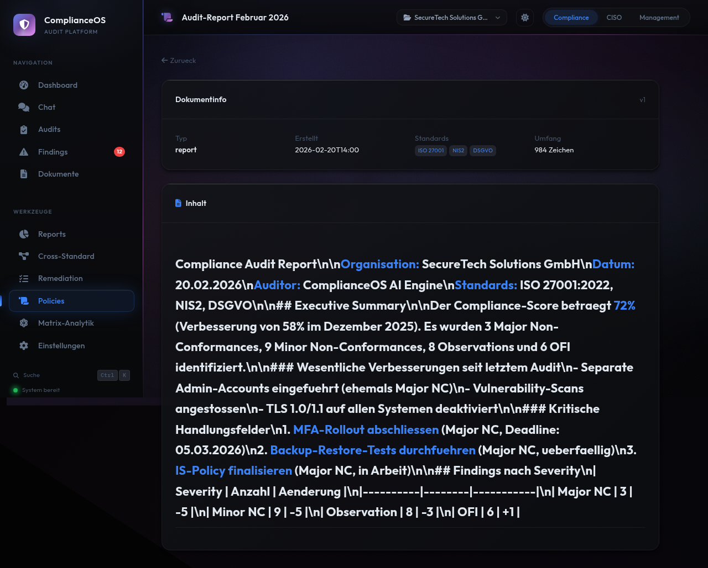

# Reports

ComplianceOS bietet umfangreiche Report- und Analysefunktionen: Audit-Reports, Drift-Detection, Cross-Standard-Mapping und Matrix-Analytik. Jeder Report-Typ richtet sich an eine andere Zielgruppe und Fragestellung.

<figure class="screenshot" markdown>

<figcaption>Reports: Report-Generator, Drift-Detection und generierte Reports in der Uebersicht</figcaption>
</figure>

---

## Audit-Report

Der Audit-Report fasst die Ergebnisse eines Audit-Laufs in einem strukturierten Dokument zusammen — geeignet fuer Management-Praesentationen, externe Auditoren und Compliance-Nachweise.

### Report erstellen

1. Navigieren Sie zu **Reports** in der Seitenleiste
2. Waehlen Sie im Dropdown den gewuenschten **Audit-Lauf**
3. Klicken Sie auf **Report generieren**
4. Der Report wird generiert und in der Liste angezeigt

### Report-Inhalt

Jeder Audit-Report enthaelt:

| Abschnitt | Inhalt |
|-----------|--------|
| **Executive Summary** | Ueberblick fuer die Geschaeftsfuehrung mit Gesamt-Score und Key-Findings |
| **Scope** | Welche Standards, Domains und Controls geprueft wurden |
| **Ergebnisse nach Severity** | Aufschluesselung aller Findings nach Schweregrad |
| **Domain-Analyse** | Detaillierte Ergebnisse pro Sicherheitsbereich |
| **Top-Findings** | Die kritischsten Abweichungen mit Empfehlungen |
| **Empfehlungen** | Priorisierte Handlungsempfehlungen |
| **Statistiken** | Controls geprueft, Compliance-Grad, Trend |

### Report-Detail

<figure class="screenshot" markdown>

<figcaption>Generierter Audit-Report: Executive Summary, Ergebnisse nach Severity und Domain-Analyse</figcaption>
</figure>

Klicken Sie in der Reports-Liste auf einen generierten Report um die Detailansicht zu oeffnen. Der Report wird als formatiertes Markdown dargestellt.

---

## Drift-Detection

Die Drift-Detection vergleicht zwei Audit-Laeufe und identifiziert Veraenderungen im Compliance-Zustand. So erkennen Sie Verbesserungen, Regressionen und stehende Findings.

### Drift-Report erstellen

1. Im Bereich **Drift Detection** waehlen Sie:
      - **Baseline**: Der aeltere Audit-Lauf (Referenzpunkt)
      - **Aktuell**: Der neuere Audit-Lauf (Vergleichspunkt)
2. Klicken Sie auf **Vergleichen**

### Drift-Kategorien

Der Drift-Report kategorisiert alle Findings:

| Kategorie | Bedeutung | Farbe | Aktion |
|-----------|-----------|-------|--------|
| **Neue Findings** | Im aktuellen Audit erstmals aufgetreten | Rot | Neue Massnahmen planen |
| **Behobene Findings** | Im Baseline vorhanden, jetzt nicht mehr | Gruen | Erfolg der Massnahmen bestaetigt |
| **Unveraenderte Findings** | In beiden Audits vorhanden | Grau | Massnahmen beschleunigen |
| **Verschlechterte Findings** | Severity hat sich erhoeht | Dunkelrot | Sofort eskalieren |

### Drift-Metriken

Zusaetzlich zeigt der Drift-Report:

- **Score-Vergleich**: Compliance-Score Baseline vs. Aktuell
- **Score-Delta**: Verbesserung oder Verschlechterung in Prozentpunkten
- **Domain-Trends**: Welche Domains sich verbessert oder verschlechtert haben
- **Regression-Count**: Anzahl neuer oder verschlechterter Findings

!!! warning "Regressionen"
    Neue Major NCs nach einem vorherigen Audit deuten auf **Regressionen** hin — Sicherheitsmassnahmen die wieder entfernt oder unwirksam geworden sind. Diese erfordern sofortige Aufmerksamkeit.

!!! tip "Regelmaessige Drift-Checks"
    Fuehren Sie nach jedem Audit einen Drift-Vergleich zum vorherigen Lauf durch. So behalten Sie die Entwicklung Ihres Compliance-Zustands im Blick und erkennen negative Trends fruehzeitig.

---

## Cross-Standard-Mapping

Das Cross-Standard-Mapping visualisiert die Beziehungen und Ueberschneidungen zwischen den 9 unterstuetzten Standards.

<figure class="screenshot" markdown>

<figcaption>Cross-Standard: Netzwerk-Graph der Standard-Beziehungen, Overlap-Matrix und Readiness-Rechner</figcaption>
</figure>

### Netzwerk-Graph

Der interaktive **Netzwerk-Graph** zeigt:

- **Knoten**: Jeder Standard als Kreis (Groesse = Anzahl Controls)
- **Kanten**: Verbindungen zwischen Standards mit gemeinsamen Controls
- **Staerke**: Dicke der Kante = Anzahl geteilter Controls

So erkennen Sie auf einen Blick welche Standards stark miteinander verknuepft sind und wo Synergien bei der Implementierung bestehen.

### Overlap-Matrix

Die **Overlap-Matrix** zeigt in einer Tabelle:

- Zeilen und Spalten: Alle 9 Standards
- Zellen: Anzahl gemeinsamer Controls
- Diagonale: Gesamtzahl Controls des Standards

### Readiness-Rechner

Der **Readiness-Rechner** beantwortet die Frage: "Wenn ich Standard X erfuelle, wie weit bin ich bei Standard Y?"

- Waehlen Sie einen Quell-Standard
- Sehen Sie den Abdeckungsgrad fuer alle anderen Standards
- Planen Sie die effizienteste Reihenfolge fuer Multi-Standard-Compliance

!!! tip "Synergien nutzen"
    ISO 27001 teilt viele Controls mit NIS2 und BSI IT-Grundschutz. Beginnen Sie mit dem Standard der die meisten Ueberschneidungen bietet — so erreichen Sie mit dem geringsten Aufwand die hoechste Abdeckung.

---

## Matrix-Analytik

Die Matrix-Analytik bietet erweiterte Visualisierungen zur Control-Verteilung und Standard-Abdeckung.

<figure class="screenshot" markdown>

<figcaption>Matrix-Analytik: Sankey-Diagramm, Pie-Chart, Automation-Topography und Coverage-Matrix</figcaption>
</figure>

### Visualisierungen

| Visualisierung | Beschreibung |
|----------------|-------------|
| **Sankey-Diagramm** | Zeigt den Fluss von Standards zu Domains — welcher Standard welche Domains abdeckt |
| **Pie-Chart** | Verteilung der Controls nach Verifikationsmethode (Automated, Hybrid, Manual) |
| **Automation-Topography** | Welche Domains den hoechsten Automatisierungsgrad haben |
| **Coverage-Matrix** | Heatmap: Standards (Zeilen) vs. Domains (Spalten) — Anzahl Controls pro Zelle |

### Coverage-Matrix lesen

Die Coverage-Matrix ist besonders wertvoll fuer die Audit-Planung:

- **Dunkle Zellen**: Viele Controls — hoher Pruefaufwand in dieser Kombination
- **Helle Zellen**: Wenige Controls
- **Leere Zellen**: Kein Control dieses Standards in dieser Domain
- **Zeilen-Summe**: Gesamtzahl Controls des Standards
- **Spalten-Summe**: Gesamtzahl Controls in der Domain

---

## Generierte Reports verwalten

Alle generierten Reports werden in der Datenbank gespeichert:

| Feld | Beschreibung |
|------|-------------|
| **Titel** | Report-Bezeichnung |
| **Typ** | Audit-Report oder Drift-Report |
| **Erstellungsdatum** | Wann der Report generiert wurde |
| **Basis-Audit** | Welcher Audit-Lauf als Grundlage diente |

Reports koennen jederzeit wieder geoeffnet und eingesehen werden.

---

## Tipps fuer effektive Reports

!!! tip "Fuer das Management"
    Generieren Sie einen Audit-Report nach jedem Vollaudit. Der Executive Summary eignet sich als Grundlage fuer Management-Praesentationen und zeigt den Compliance-Status auf einen Blick.

!!! tip "Fuer externe Auditoren"
    Stellen Sie externen Auditoren den vollstaendigen Audit-Report plus die Cross-Standard-Matrix zur Verfuegung. So sehen Auditoren sofort welche Standards abgedeckt sind und wo die Schwerpunkte liegen.

!!! tip "Fuer die Planung"
    Nutzen Sie die Matrix-Analytik und den Readiness-Rechner um die effizienteste Reihenfolge fuer die Implementierung weiterer Standards zu bestimmen.

---

## Video: Drift-Detection

<video controls width="100%">
  <source src="../videos/drift-detection.mp4" type="video/mp4">
  Ihr Browser unterstuetzt kein Video. <a href="../videos/drift-detection.mp4">Video herunterladen</a>.
</video>

Das Video zeigt die Drift-Detection und Report-Funktionen: Vom Reports-Bereich ueber die Drift-Analyse zweier Audit-Laeufe bis zur Cross-Standard-Matrix und Matrix-Analytik.
