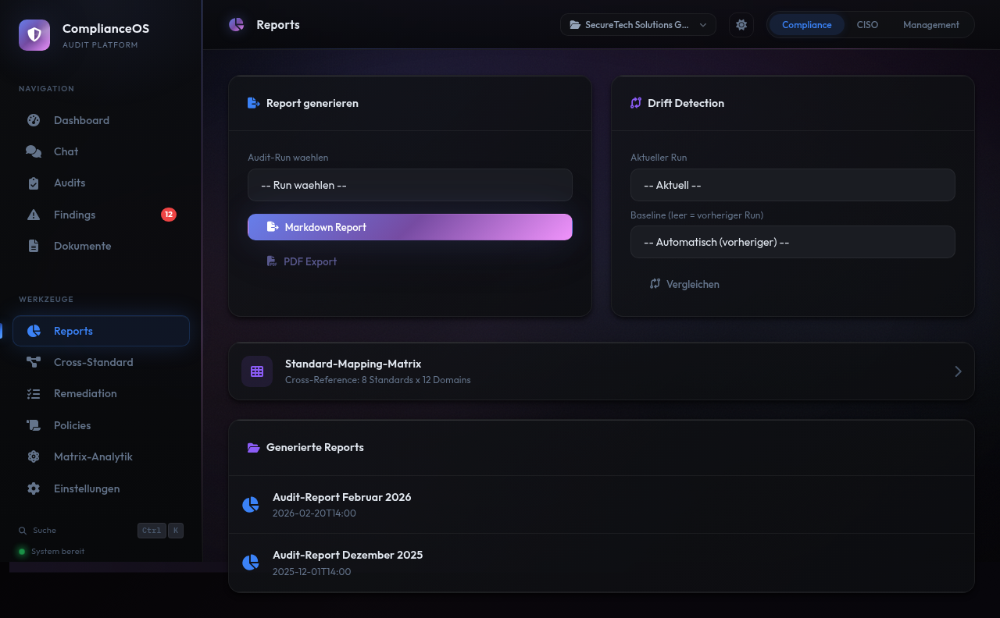
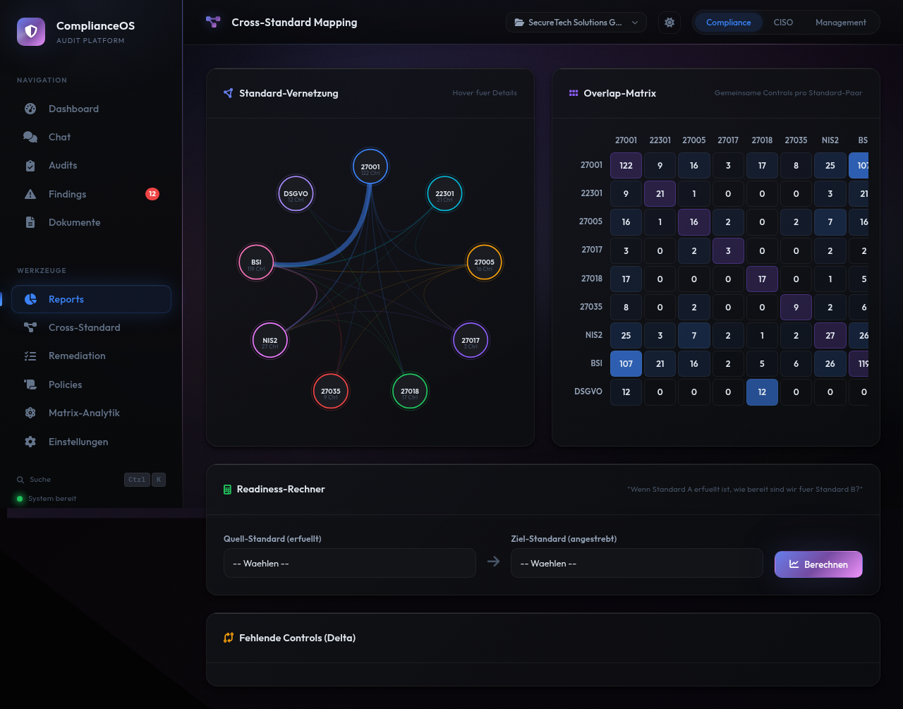
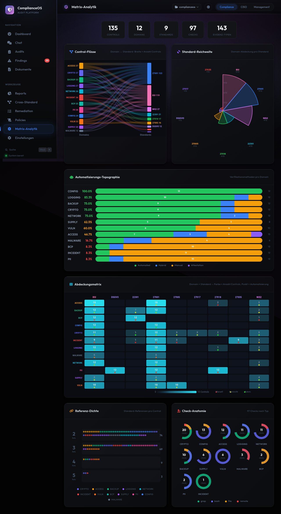

# Reports

ComplianceOS bietet verschiedene Report-Typen fuer unterschiedliche Zielgruppen.

## Audit-Report

Der Audit-Report fasst die Ergebnisse eines Audit-Laufs zusammen:

- Gesamtbewertung mit Compliance-Score
- Findings nach Severity aufgeschluesselt
- Domain-weise Analyse
- Empfehlungen priorisiert nach Risiko

### Report erstellen

1. Navigieren Sie zu **Reports**
2. Waehlen Sie einen Audit-Lauf
3. Klicken Sie auf **Report generieren**

Der Report wird als Markdown generiert und kann direkt im Browser angesehen werden.

## Drift-Detection

Die Drift-Detection vergleicht zwei Audit-Laeufe und zeigt Veraenderungen:

- **Neue Findings:** Im neueren Audit erstmals aufgetreten
- **Behobene Findings:** Im aelteren Audit vorhanden, jetzt behoben
- **Unveraenderte Findings:** In beiden Audits vorhanden
- **Verschlechterte Findings:** Severity hat sich erhoeht

### Drift-Report erstellen

1. Navigieren Sie zu **Reports > Drift**
2. Waehlen Sie Baseline-Audit (aelter) und aktuellen Audit
3. Klicken Sie auf **Vergleichen**

!!! tip "Regressive Drift"
    Achten Sie besonders auf neue Major NCs — diese deuten auf
    Regressionen in Ihrer Sicherheitslage hin.

## Cross-Standard-Mapping

Zeigt, wie Controls standarduebergreifend zugeordnet sind:

- Welche ISO-27001-Controls auch NIS2-Anforderungen abdecken
- Wo Synergien zwischen Standards bestehen
- Welche Bereiche nur von einem Standard abgedeckt werden

## Standard-Matrix

Die Standard-Matrix zeigt den Compliance-Grad pro Standard auf einen Blick:

| Standard | Score | Findings |
|----------|-------|----------|
| ISO 27001 | 78% | 12 |
| NIS2 | 65% | 8 |
| BSI | 72% | 15 |
| ... | ... | ... |
