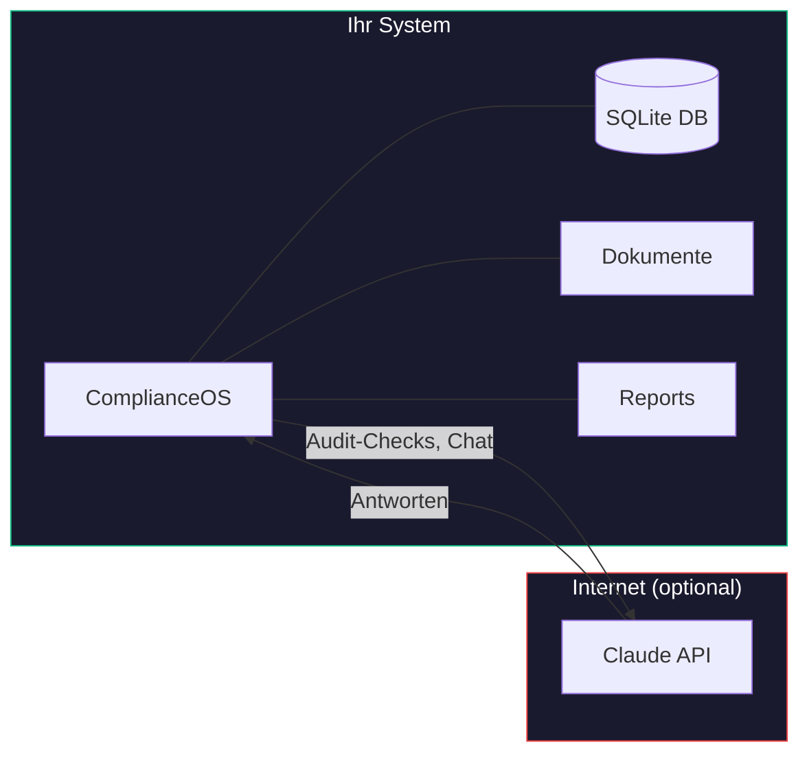

# Datenschutz

ComplianceOS ist als On-Premise-Anwendung konzipiert. Ihre Daten bleiben auf Ihrer Infrastruktur.

## Was bleibt lokal?

Folgende Daten verlassen Ihr System **niemals**:

- SQLite-Datenbank (Audit-Ergebnisse, Findings, Projekte)
- Hochgeladene Dokumente (PDF, DOCX, XLSX, etc.)
- Generierte Policies und Reports
- Einstellungen und Praeferenzen
- Chat-Verlauf (die gespeicherten Nachrichten)

## Was wird an Claude AI gesendet? (optional)

Wenn die KI-Integration aktiviert ist (`ENABLE_TEAMMATES=true`), werden folgende Daten an die Claude API (Anthropic) gesendet:

- Audit-Pruefpunkte und deren Kontext
- Findings-Beschreibungen zur Analyse
- Chat-Nachrichten des Benutzers
- System-Prompts mit Compliance-Kontext



## KI-Integration deaktivieren

Setzen Sie in `docker-compose.yml`:

```yaml
environment:
  - ENABLE_TEAMMATES=false
```

Ohne KI-Integration funktionieren alle Kernfunktionen (Audits, Findings, Policies, Reports) weiterhin vollstaendig. Nur der Chat-Assistent und die KI-gestuetzte Analyse sind dann nicht verfuegbar.

## Keine Telemetrie

ComplianceOS sendet **keine** Nutzungsdaten, Crash-Reports oder Analytics an Dritte. Es gibt keinen "Phone Home"-Mechanismus.
