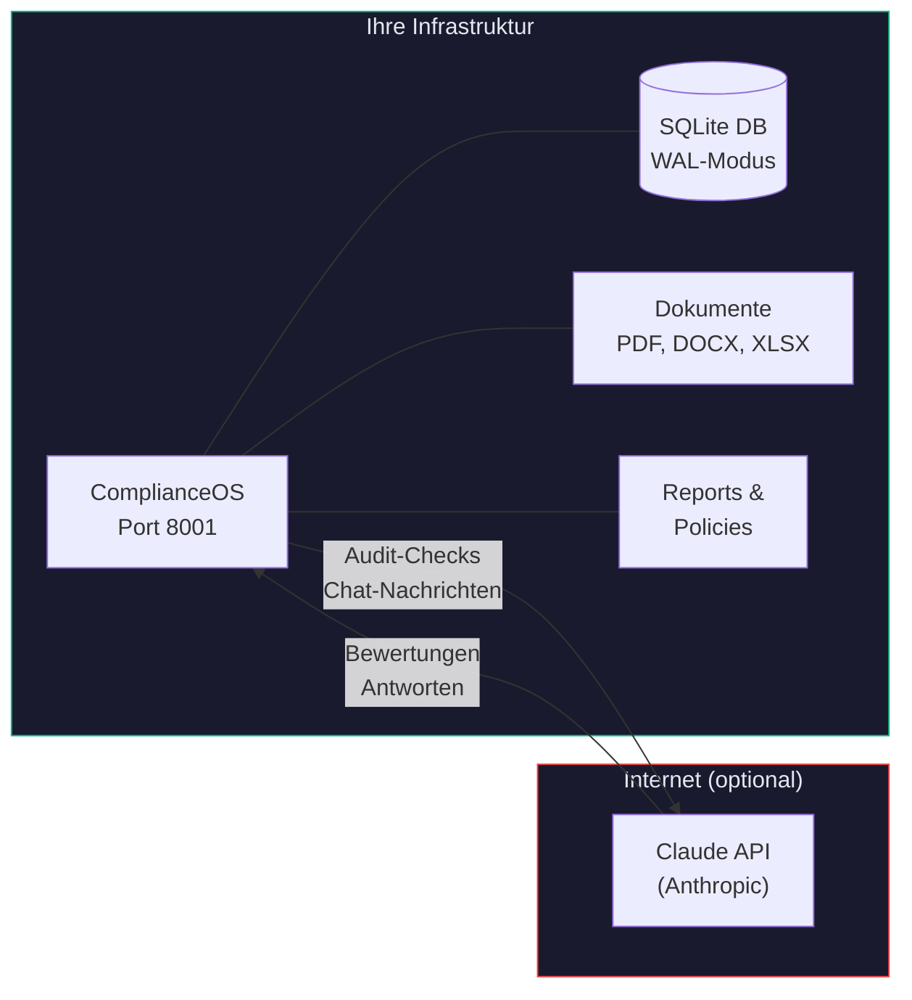

# Datenschutz

ComplianceOS ist als **On-Premise-Anwendung** konzipiert. Ihre Daten bleiben auf Ihrer Infrastruktur. Diese Seite erklaert im Detail, welche Daten wo verarbeitet werden.

---

## Datenfluss-Uebersicht



---

## Was bleibt lokal?

Folgende Daten verlassen Ihr System **unter keinen Umstaenden**:

| Daten | Speicherort | Verschluesselung |
|-------|-------------|-----------------|
| SQLite-Datenbank | `data/complianceos.db` | Dateisystem-Ebene (empfohlen: LUKS/dm-crypt) |
| Hochgeladene Dokumente | `data/uploads/` | Dateisystem-Ebene |
| Generierte Policies | In der Datenbank (`generated_document`) | Dateisystem-Ebene |
| Audit-Reports | In der Datenbank (`generated_document`) | Dateisystem-Ebene |
| Chat-Verlaeufe | In der Datenbank (`chat_session`, `chat_message`) | Dateisystem-Ebene |
| Einstellungen | In der Datenbank (`preference`) | Dateisystem-Ebene |
| Risikobewertungen | In der Datenbank (`risk_assessment`) | Dateisystem-Ebene |
| OAuth-Tokens | `~/.claude/.credentials.json` | Datei-Permissions (chmod 600) |

!!! tip "Verschluesselung"
    ComplianceOS verschluesselt Daten nicht auf Anwendungsebene. Fuer Verschluesselung at Rest nutzen Sie LUKS (Linux), FileVault (macOS) oder BitLocker (Windows) auf Dateisystem-Ebene.

---

## Was wird an Claude AI gesendet?

Wenn die KI-Integration aktiv ist, werden folgende Daten an die Claude API (Anthropic, `api.anthropic.com`) gesendet:

### Bei Audit-Durchfuehrung

| Daten | Beispiel | Zweck |
|-------|---------|-------|
| Control-Beschreibung | "A.8.5: Sichere Authentifizierung" | KI-Bewertung des Pruefpunkts |
| Gefundene Evidenz | Dateinamen, Konfigurationsauszuege | Kontext fuer Bewertung |
| System-Prompt | Audit-Anweisungen, Bewertungskriterien | Steuerung der KI-Analyse |

### Bei Chat-Nutzung

| Daten | Beispiel | Zweck |
|-------|---------|-------|
| Benutzer-Nachricht | "Welche MFA-Methoden empfiehlst du?" | Beantwortung der Frage |
| Compliance-Kontext | Aktive Standards, letzte Findings | Kontextbezogene Antwort |
| System-Prompt | Rolle, Sprache, erlaubte Themen | Steuerung des Assistenten |

### Was wird NICHT gesendet

- Hochgeladene Dokumente (bleiben lokal)
- Passwort-Richtlinien oder Credentials
- Personenbezogene Daten aus der Datenbank
- Vollstaendige Datenbank-Inhalte
- OAuth-Tokens oder API-Keys

---

## KI-Integration deaktivieren

### Per Umgebungsvariable

```yaml
# docker-compose.yml
environment:
  - ENABLE_TEAMMATES=false
```

### Per Einstellungen

Unter **Einstellungen** > **Feature Flags** koennen Sie die KI-Features granular steuern:

| Feature Flag | Beschreibung |
|-------------|-------------|
| `teammates` | KI-Agent-Orchestrierung (parallele Audit-Bewertung) |
| `policy_gen` | KI-gestuetzte Policy-Generierung |

Ohne KI-Integration funktionieren alle Kernfunktionen weiterhin:

- Audits mit regelbasierten Checks (ohne KI-Bewertung)
- Findings-Verwaltung und Status-Workflow
- Remediation-Tracking (Kanban, Liste, Kalender)
- Reports und Drift-Detection
- Cross-Standard-Mapping und Matrix-Analytik
- Executive Risk Dashboard
- Dokumente hochladen und analysieren (Parser-Pipeline)

---

## Keine Telemetrie

ComplianceOS sendet **keine**:

- Nutzungsstatistiken
- Crash-Reports
- Analytics oder Tracking-Daten
- Heartbeat- oder Phone-Home-Signale

Es gibt keinen Hintergrund-Dienst, der Daten nach aussen sendet. Die einzige externe Kommunikation ist die explizite Claude API-Nutzung (wenn aktiviert).

---

## Datenschutz-Empfehlungen

!!! danger "Fuer regulierte Umgebungen"
    Wenn Sie ComplianceOS in Umgebungen mit strengen Datenschutz-Anforderungen einsetzen (z.B. Gesundheitswesen, Finanzsektor), beachten Sie:

1. **KI deaktivieren**: Setzen Sie `ENABLE_TEAMMATES=false` wenn keine Daten das Netzwerk verlassen duerfen
2. **Festplattenverschluesselung**: Aktivieren Sie LUKS/dm-crypt auf dem Host
3. **Netzwerk-Isolation**: Binden Sie ComplianceOS nur an `127.0.0.1` oder ein internes Netz
4. **Zugriffskontrolle**: Nutzen Sie einen Reverse Proxy mit Authentifizierung (z.B. nginx + Basic Auth oder SSO)
5. **Backup-Verschluesselung**: Verschluesseln Sie Backups der `data/`-Verzeichnisse
6. **Log-Rotation**: Konfigurieren Sie Log-Rotation um sensitive Informationen nicht unbegrenzt vorzuhalten
