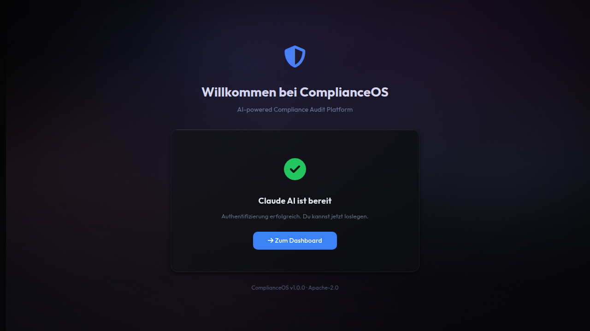

# Claude-Setup

ComplianceOS nutzt **Claude AI** fuer KI-gestuetzte Funktionen: Chat-Beratung, Audit-Bewertungen und Policy-Generierung. Die Authentifizierung erfolgt per OAuth direkt im Browser.

!!! info "Ohne Claude AI nutzbar"
    Claude AI ist optional. Alle Kernfunktionen (Audits, Findings, Remediation, Reports, Matrix-Analytik) funktionieren auch ohne KI-Anbindung.

---

## Voraussetzung

Sie benoetigen eine **Claude Code Subscription** von [claude.ai](https://claude.ai). ComplianceOS verwendet die gleiche Authentifizierung wie die Claude CLI.

---

## Setup-Seite

Beim ersten Start leitet ComplianceOS Sie automatisch auf die Setup-Seite weiter:

<figure class="screenshot" markdown>

<figcaption>Setup-Seite: Claude AI ist bereits verbunden</figcaption>
</figure>

---

## Authentifizierung starten

ComplianceOS unterstuetzt zwei OAuth-Flows, abhaengig davon wie Sie auf die Anwendung zugreifen:

### Flow 1: Lokaler Zugriff (localhost)

Wenn Sie ComplianceOS ueber `localhost` oder `127.0.0.1` oeffnen, wird der **Auto-Redirect-Flow** verwendet:

1. Klicken Sie auf **"Mit Claude verbinden"**
2. Sie werden zu `claude.ai` weitergeleitet
3. Melden Sie sich an und autorisieren Sie den Zugriff
4. Der Browser leitet Sie automatisch zurueck zu ComplianceOS
5. Die Authentifizierung ist abgeschlossen

!!! tip "Empfohlener Flow"
    Der Auto-Redirect ist der schnellste Weg. Er funktioniert nur bei lokalem Zugriff, da der OAuth-Callback an `localhost` zurueckgeleitet wird.

### Flow 2: Remote-Zugriff (Server-IP)

Wenn Sie ComplianceOS ueber eine Server-IP oder einen Hostnamen erreichen (z.B. `http://10.0.0.42:8001`), wird der **Manuelle-Code-Flow** verwendet:

1. Klicken Sie auf **"Mit Claude verbinden"**
2. Es oeffnet sich ein neues Fenster/Tab zu `claude.ai`
3. Melden Sie sich an und autorisieren Sie den Zugriff
4. Claude zeigt Ihnen einen **Autorisierungscode** an
5. Kopieren Sie diesen Code
6. Fuegen Sie den Code in das Eingabefeld auf der ComplianceOS-Seite ein
7. Klicken Sie auf **"Code absenden"**

!!! warning "Code-Gueltigkeit"
    Der Autorisierungscode ist nur wenige Minuten gueltig. Wenn er ablaeuft, starten Sie den Vorgang erneut ueber `/setup`.

---

## Verbindung pruefen

Nach erfolgreicher Authentifizierung zeigt die Setup-Seite:

- **"Claude AI ist bereit"** mit gruenem Haekchen
- Der Button **"Zum Dashboard"** wird sichtbar

In den **Einstellungen** sehen Sie den aktuellen Claude-Status unter dem Abschnitt "Claude AI":

- **Gruen**: "Claude AI ist authentifiziert und einsatzbereit"
- **Gelb**: "Claude CLI installiert, aber nicht authentifiziert"
- **Rot**: "Claude CLI nicht gefunden"

---

## Technische Details

### Token-Speicherung

Die OAuth-Tokens werden unter `~/.claude/.credentials.json` gespeichert (gleicher Pfad wie die Claude CLI). Das Format ist kompatibel — wenn Sie bereits `claude auth login` ausgefuehrt haben, erkennt ComplianceOS die bestehende Authentifizierung.

### Scopes

ComplianceOS fordert folgende OAuth-Scopes an:

| Scope | Verwendung |
|-------|-----------|
| `user:inference` | KI-Anfragen fuer Chat und Audit-Bewertungen |
| `user:profile` | Benutzername fuer Anzeige |
| `user:sessions:claude_code` | Session-Management |

### Token-Erneuerung

Access-Tokens werden automatisch per Refresh-Token erneuert. Eine manuelle Neu-Authentifizierung ist nur bei Widerruf oder nach laengerer Inaktivitaet noetig.

---

## Fehlerbehebung

### "Session abgelaufen"

Die PKCE-Session (OAuth-Sicherheitsparameter) ist nach 15 Minuten abgelaufen. Starten Sie den Vorgang erneut ueber `/setup`.

### "Code ungueltig oder bereits verwendet"

Der Autorisierungscode kann nur einmal verwendet werden. Starten Sie den Vorgang erneut.

### Claude CLI vs. ComplianceOS Auth

Wenn Sie die Claude CLI (`claude auth login`) bereits nutzen, muessen Sie sich nicht erneut authentifizieren — ComplianceOS liest die bestehenden Credentials aus `~/.claude/.credentials.json`.

---

## Naechste Schritte

Nach der Authentifizierung:

1. [Erste Schritte](erste-schritte.md) — Projekt anlegen und ersten Audit durchfuehren
2. [Chat](../bedienung/chat.md) — KI-gestuetzte Compliance-Beratung nutzen
